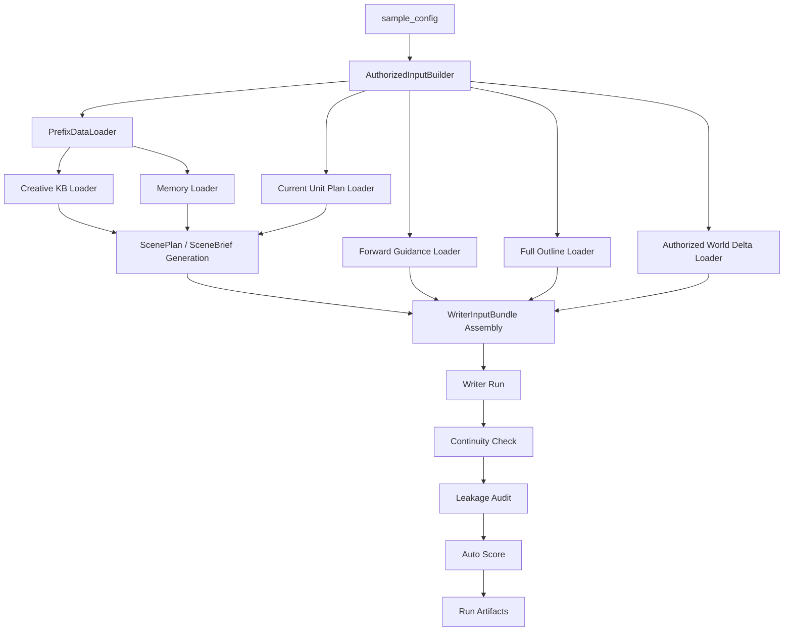

# 小说续写 Agentic Benchmark 实现设计稿

## 1. 目标

本设计稿把 [`spec.md`](.trae/specs/agentic-benchmark/spec.md) 进一步细化到可编码实现的程度，重点回答：

- benchmark 数据集样本如何组织
- 三种 mode 如何裁剪授权输入边界
- `forward_guidance` 如何在运行时进入 writer 输入
- 自动评分如何拆成规则检查与 judge 检查两段
- 运行产物如何落盘并支持复现、对比与消融
- benchmark / 训练样本如何在不造成信息泄漏的前提下复用 Memory、完整大纲与局部未来约束

## 2. 模块定位

`agentic-benchmark` 是 `specs/` 下独立模块，其职责不是直接生成小说，而是：

- 构建 benchmark sample
- 复现受控运行条件
- 驱动主续写链路
- 采集过程产物
- 对结果执行自动评分
- 支持人工复核与消融对比

它依赖但不替代以下模块：

- `novel-continuation-mvp`: 主续写编排
- `creative-knowledge-base`: 检索与 rerank
- `narrative-memory-context`: 事实型上下文
- `writer-agent-layered-generation`: 规划与分层写作

benchmark 还承担一个重要工程职责：

- 把“前缀事实”与“显式授权的未来约束”分开记录
- 让训练样本和 benchmark 样本都能复用同一套防泄漏边界
- 在不修改 frozen contract 语义的前提下，复现实验输入

## 2.0 MVP-0: Single Sample Smoke Benchmark

在完整 agentic benchmark 落地前，先提供一个最小可运行版本，用于回答：

- 当前 Agent 是否能从真实文本 fixture 出发，完整跑通粗读、精读、Creative KB、Writer 分层规划与 Reviewer
- 大纲到梗概、梗概到正文两个层级是否分别成立
- 生成梗概和生成正文是否至少达到约 60 分：逻辑通顺、剧情能接上、符合对应层级的授权输入
- 用户能否在 CLI 中快速得到一个能力边界判断

该 MVP 的目标不是验证局部 wiring，而是验证真实 LLM 驱动的端到端 Agent 链路。  
系统不得用本地虚构 summary、synthetic DB 或 deterministic fallback 代替粗读/精读结果。

```text
novel_agent/tests/longzu_32kb.txt fixture
  -> split prefix source + held-out reference truth
  -> real segmentation / rough read on prefix source
  -> real close read on prefix source
  -> real Creative KB build
  -> real Writer planning workflow through ChapterPackage / ChapterBrief
  -> extract Writer ChapterBrief as generated_story_synopsis.json
  -> held-out reference truth -> reference_story_synopsis.json
  -> LLM SynopsisReviewer compares generated synopsis with reference synopsis
  -> real Writer prepare_execution / execute_frozen_chapter
  -> extract Writer draft.md as expansion/draft.md
  -> LLM ExpansionReviewer compares draft with reference truth and reference synopsis
  -> reviewer_report.json combines both layers
  -> CLI summary
```

### Canonical Runner

历史 single sample runner 仍保留为底层兼容入口，但 **Agentic smoke benchmark 的 canonical path** 是：

- `novel_agent/app/run_single_sample_smoke.py`
- `AgenticSmokeBenchmarkService`
- 粗读/精读 pipeline
- Writer workflow

`SingleSampleSmokeRunner` 可以继续用于旧 sample/db 兼容测试，但不得作为端到端 benchmark 的替代品。

### Fixture: `longzu_32kb.txt`

MVP 使用真实文本 fixture：

```text
novel_agent/tests/longzu_32kb.txt
```

该文件来自 `~/longzu.txt` 的前 32KB 以内片段。生成 fixture 时必须按字节截取上限，再回退到最后一个换行符，确保：

- 文件大小不超过 32KB
- 文件以换行符结尾
- 不截断 UTF-8 字符
- 不截断半行文本

推荐样本构造方式：

- 从 `longzu_32kb.txt` 中切出 prefix source
- 从 prefix 之后的目标段或目标段组构造 held-out reference truth
- 只对 prefix source 运行真实粗读、精读、Creative KB 与 Writer
- held-out reference truth 不进入粗读、精读、Writer 输入，只进入 Reviewer 与人工复核

禁止生成 synthetic `longzu_smoke.db` 来伪装粗读/精读产物。

### Longer Fixtures and Modeling Cache

长文本回归使用仓库内稳定 fixture：

```text
novel_agent/tests/longzu_96kb.txt
novel_agent/tests/longzu_120kb.txt
novel_agent/tests/longzu_240kb.txt
```

这些文件从 `/Users/luliao/longzu.txt` 按对应字节上限截取，并回退到最后一个换行符。`longzu_120kb.txt` 用于在 96KB 仍偏短时，把 prefix 建模和 held-out reference truth 推到更靠后的剧情位置。
`longzu_240kb.txt` 用于 Outline Research Loop 的 author brief reconstruction smoke：前 120KB 作为 prefix modeling snapshot，后 120KB 作为用户授权剧情概述和 reference-only 对照来源。

为了控制 DeepSeek token 成本，`AgenticSmokeBenchmarkService` 支持 modeling cache。缓存边界只覆盖 Writer 之前的真实建模层：

```text
source + window params + pipeline params
  -> cache key
  -> prefix rough-read / close-read DB
  -> Creative KB artifacts
  -> reference close-read DB/context
  -> reference_story_synopsis.json
  -> benchmark_story_outline.json
  -> writer_planning_input.json
```

cache hit 之后仍必须重新执行：

- Writer planning workflow
- `generated_story_synopsis.json` 从 Writer artifacts 规范化
- `expansion/writer_execution_input.json` 由 close-read reference synopsis 包装而来
- Writer draft generation interface
- SynopsisReviewer / ExpansionReviewer / combined reviewer

长文本回归不应继续使用 32KB smoke 的短 reference window。`run_single_sample_smoke.py` 暴露 `--reference-min-chars`，用于把 held-out reference truth 扩大到连续多个 document/chunk。reference close-read 会把这些连续 summary 组装成：

```json
{
  "combined_synopsis": "连续剧情梗概",
  "document_synopses": [
    {"order": 1, "summary": "..."},
    {"order": 2, "summary": "..."}
  ]
}
```

Expansion benchmark 会把 `document_synopses` 写入 `chapter_brief.reference_document_synopses` 和 `expansion_guidance`，Writer execution prompt 必须按 `order` 合并扩写，而不是只扩写第一条 summary。

这样复用的是真实建模结果，而不是绕过 Agentic flow 的 parallel runner。cache miss、`--rebuild-modeling-cache` 或 `--clear-modeling-cache` 后的下一次运行仍会调用真实 DeepSeek 粗读、精读和 Creative KB。

推荐 120KB writer-only 回归命令：

```bash
PYTHONUNBUFFERED=1 .venv/bin/python -m novel_agent.app.run_single_sample_smoke \
  --source novel_agent/tests/longzu_120kb.txt \
  --runs-dir runs/benchmarks/longzu_120kb \
  --use-real-model \
  --api-key "$DEEPSEEK_API_KEY" \
  --prefix-min-chars 30000 \
  --reference-min-chars 10000 \
  --max-read-kb 120 \
  --max-close-batches 24 \
  --reuse-modeling-cache
```

周期性验证 close-read 正确性时，使用：

```bash
PYTHONUNBUFFERED=1 .venv/bin/python -m novel_agent.app.run_single_sample_smoke \
  --source novel_agent/tests/longzu_120kb.txt \
  --runs-dir runs/benchmarks/longzu_120kb \
  --use-real-model \
  --api-key "$DEEPSEEK_API_KEY" \
  --prefix-min-chars 30000 \
  --reference-min-chars 10000 \
  --max-read-kb 120 \
  --max-close-batches 24 \
  --rebuild-modeling-cache
```

连续三章 Writer smoke 使用同一 cache，但显式开启 sequence：

```bash
PYTHONUNBUFFERED=1 .venv/bin/python -m novel_agent.app.run_single_sample_smoke \
  --source novel_agent/tests/longzu_120kb.txt \
  --runs-dir runs/benchmarks/longzu_120kb \
  --use-real-model \
  --api-key "$DEEPSEEK_API_KEY" \
  --prefix-min-chars 30000 \
  --reference-min-chars 10000 \
  --sequence-chapter-count 3 \
  --max-read-kb 120 \
  --max-close-batches 24 \
  --reuse-modeling-cache
```

sequence 模式落盘结构：

```text
runs/benchmarks/<run_id>/
  sequence/
    chapter_01/
      benchmark_story_outline.json
      writer_planning_input.json
      generated_story_synopsis.json
      reference_story_synopsis.json
      synopsis_reviewer_report.json
      expansion/
        writer_execution_input.json
        prompt.json
        draft.md
      expansion_reviewer_report.json
      writeback_result.json
    chapter_02/
    chapter_03/
    generated_story_synopses.json
    reference_story_synopses.json
    draft.md
    synopsis_reviewer_report.json
    expansion_reviewer_report.json
```

实现约束：

- 每个 chapter step 都单独调用 Writer planning workflow，生成的 ChapterBrief 只作为 synopsis layer 评分对象。
- Expansion step 将对应 close-read reference synopsis 包装成 Writer execution input，并覆盖 Freeze D 后调用 Writer 正式 `execute_current_chapter`。
- 正文通过 continuity 后写入 `generation_review_decision=accepted`，再走 `approve_writeback` 写回 Writer memory DB。
- 下一 step 从写回后的 writer DB 重新读取 recent synopses / character docs，验证连续生成上下文是否滚动。

### Outline Research Author Brief Reconstruction Smoke

Outline Research Loop 需要一条比普通 continuation smoke 更直接的真实模型验收路径。该 smoke 的目标不是让 Writer 盲猜后续剧情，而是模拟作者已经给出一段高信息密度但不完整的剧情概述，验证 Writer 是否能：

- 从用户概述中抽取人物提及
- 通过约定好的 tool call 查询前文已有角色、世界观概念和历史故事细节
- 把新增人物与既有人物区分开
- 基于多轮 research 生成接近 reference outline 的高密度大纲

该模式命名为 **Author Brief Reconstruction Smoke**。

```text
~/longzu.txt
  -> cut longzu_240kb.txt
  -> split prefix_120kb + future_120kb

prefix_120kb
  -> real rough-read
  -> real close-read
  -> real Creative KB / Memory artifacts
  -> save prefix modeling snapshot
  -> build ChapterSummaryIndex / HistoricalOutlineEventIndex

future_120kb
  -> real close-read
  -> reference_future_outline.json
  -> reference_character_set.json
  -> summarize close-read chapter synopses into 500-1000 char user_story_overview

Writer smoke
  -> user_story_overview + prefix modeling snapshot
  -> ExtractedCharacterMentions
  -> CharacterMentionResolution through tool call / resolver
  -> Outline Research Loop with BTree descent Memory queries
      -> event_summary root page scan
      -> event list drill-down
      -> chapter summary drill-down
      -> optional document excerpt drill-down
  -> generated_outline.json
  -> optional small expansion draft through formal Writer execution
  -> OutlineResearchReviewer
```

#### Input Boundary

Author brief smoke 仍必须遵守防泄漏边界，但它和 blind continuation smoke 的授权输入不同：

- `prefix_facts`: 只来自前 120KB 的粗读、精读、Creative KB、Memory、世界观和历史大纲索引快照。
- `authorized_user_input`: 由后 120KB close-read 章梗概浓缩出的 500-1000 字 `user_story_overview`。它模拟用户给 Writer 的原始写作意图，可以进入 Writer。
- `reference_only`: 后 120KB 的详细 close-read 分章梗概、reference outline、reference character set 和原文，只能进入 Reviewer、泄漏审计和人工复核，不能进入 Writer prompt、Context Broker 或 tool call resolver。

因此，后 120KB 的浓缩概述不是泄漏，它是用户授权输入；后 120KB 的详细 outline 和人物全集才是隐藏答案。

#### Multi-round Memory Query

Author brief smoke 应验证新 Memory 架构，而不是退回一轮固定输入：

- Writer 初始输入只包含 `user_story_overview`、prefix modeling snapshot 和轻量索引。
- Writer 通过 Outline Research Loop 主动提出 `story_detail`、`character_profile`、`world_concept` 和 `structure_pattern` 请求。
- 对 `story_detail`，Context Broker 触发 Memory BTree descent：
  - 先让模型看 `event_summary` root pages，选择目标剧情范围
  - 再展开该范围的 event list，让模型选择相关 event ids
  - 再展开相关 chapter summary，让模型选择是否需要某些章节的详细 summary
  - 最后按需展开到 document excerpt
- `query_suffix_chain` 和 `memory_query_trace` 必须落盘，证明查询是逐层收窄的，而不是一次性把 prefix Memory 全量塞给 Writer。
- 该多轮流程只改变 Writer 获取 prefix facts 的方式，不改变最终 Reviewer 的评分目标。

#### Reasoning / Decision Debug Logs

为了判断多轮 research 是否真正有效，benchmark 框架应将“模型可见的推理调试信息”纳入测试日志：

- 如果模型 API 返回 `reasoning_content`、`reasoning` 或等价可见 debug 字段，benchmark 将其原样保存到 `model_reasoning_debug.json`。
- 如果模型 API 不返回可见 reasoning 字段，benchmark 不得伪造思维链，而是保存结构化决策轨迹：
  - prompt id / request id
  - 当前层候选 ids
  - selected ids
  - `query_suffix`
  - reason
  - confidence
  - budget state
  - final evidence ids
- reasoning/debug trace 只用于 benchmark debug、Reviewer 与人工复核，不得回流到 Writer 下一轮输入。
- 默认单元测试使用 fake facade 时可以断言 trace 字段存在，但不得伪造真实模型返回。

#### Modeling Cache

该 smoke SHOULD 复用 `AgenticSmokeBenchmarkService` 的 modeling cache，但 cache key 必须包含：

- source path 或 fixture id
- `prefix_chars=120KB`
- `future_chars=120KB`
- rough-read / close-read 参数
- Creative KB 参数
- author brief summarizer prompt version

推荐缓存边界：

```text
longzu_240kb + window params
  -> prefix_modeling_cache/
       prefix_rough_read
       prefix_close_read
       creative_kb_artifacts
       prefix_story_outline
       prefix_character_snapshot
       chapter_summary_index
       historical_outline_event_index
  -> future_reference_cache/
       future_close_read
       reference_future_outline.json
       reference_character_set.json
       user_story_overview.txt
```

cache hit 后仍必须真实重跑：

- Writer Outline Research Loop
- CharacterMentionResolution
- generated outline generation
- OutlineResearchReviewer

因为该 smoke 主要验证模型是否能主动研究、选择 tool call、判断信息是否足够，并生成大纲。

#### Character Evaluation

`reference_character_set.json` 应至少区分：

```json
{
  "existing_characters": [
    {
      "name": "string",
      "prefix_evidence": ["source ids from prefix_120kb"],
      "future_evidence": ["source ids from future_120kb"]
    }
  ],
  "new_characters": [
    {
      "name": "string",
      "future_evidence": ["source ids from future_120kb"]
    }
  ]
}
```

Writer 不得直接读取该 reference set。Reviewer 用它检查：

- `ExtractedCharacterMentions` 是否覆盖 user_story_overview 中的关键人物名
- 前 120KB 已出现人物是否通过 `character_profile` / Character Memory resolver 对齐到既有人物
- 后 120KB 新人物是否进入 `missing` / `new character seed` 流程，而不是被错误绑定到既有人物
- 未出现在授权输入或 prefix facts 中的人物是否被模型凭空加入大纲

#### OutlineResearchReviewer

Author brief smoke 增加第三个 Reviewer：`OutlineResearchReviewer`。它读取：

- prefix story outline / recent story summaries
- `user_story_overview.txt`
- `outline_seed_packet.json`
- `outline_research_trace.json`
- `planning_notebook.json`
- `generated_outline.json`
- `reference_future_outline.json`
- `reference_character_set.json`

它不得把 reference-only 材料反馈给 Writer。最小报告格式：

```json
{
  "decision": "pass | borderline | fail",
  "score": 0.0,
  "summary": "string",
  "checks": {
    "outline_similarity": "pass | borderline | fail",
    "plot_node_coverage": "pass | borderline | fail",
    "character_extraction": "pass | borderline | fail",
    "existing_character_resolution": "pass | borderline | fail",
    "new_character_detection": "pass | borderline | fail",
    "research_tool_usefulness": "pass | borderline | fail",
    "leakage_boundary": "pass | suspicious | leaked"
  },
  "scores": {
    "outline_similarity_score": 0,
    "plot_node_coverage_score": 0,
    "character_extraction_recall": 0,
    "existing_character_resolution_score": 0,
    "new_character_detection_score": 0,
    "research_tool_usefulness_score": 0
  },
  "major_failures": []
}
```

评分重点：

- 大纲是否覆盖 reference outline 的主要剧情节点、人物行动、场景变化和结果
- 大纲是否使用 prefix facts 中已有的关系状态、世界规则和历史事件
- research trace 中的 tool call 是否有实际贡献，而不是只产生空查询或重复查询
- sufficiency decision 是否合理，是否过早认为信息足够
- 是否把 assumptions 标注为 assumptions，而不是伪装成 confirmed facts

#### Artifacts

Author brief smoke 的产物 SHOULD 落盘到：

```text
runs/benchmarks/<run_id>/outline_research_author_brief/
  prefix_source.txt
  future_source.txt
  user_story_overview.txt
  prefix_modeling_snapshot.json
  chapter_summary_index.json
  historical_outline_event_index.json
  reference_future_outline.json
  reference_character_set.json
  outline_seed_packet.json
  extracted_character_mentions.json
  character_resolution.json
  outline_research_trace.json
  memory_query_trace.json
  memory_query_decision_log.json
  model_reasoning_debug.json
  planning_notebook.json
  sufficiency_decision.json
  generated_outline.json
  outline_research_reviewer_prompt.json
  outline_research_reviewer_report.json
  leakage_audit.json
  summary.json
```

#### Entrypoints

独立脚本入口 SHOULD 复用 `run_single_sample_smoke.py`：

```bash
PYTHONUNBUFFERED=1 .venv/bin/python -m novel_agent.app.run_single_sample_smoke \
  --source novel_agent/tests/longzu_240kb.txt \
  --runs-dir runs/benchmarks/outline_research_longzu_240kb \
  --use-real-model \
  --api-key "$DEEPSEEK_API_KEY" \
  --prefix-min-chars 120000 \
  --reference-min-chars 120000 \
  --max-read-kb 240 \
  --max-close-batches 48 \
  --enable-outline-research-loop \
  --outline-research-author-brief \
  --reuse-modeling-cache
```

统一 CLI / TUI 中 SHOULD 暴露：

```text
/benchmark longzu-240kb --outline-research --author-brief
```

短调试路径 MAY 使用更小窗口，但不得替代 240KB author brief smoke 的真实回归意义。

### Reusable Components

为了让 benchmark 能在 CLI 中使用，同时避免把 UI 逻辑塞进 runner，建议拆分为以下服务：

```text
AgenticSmokeBenchmarkService
  - split source into prefix source + held-out reference truth
  - run real rough read / close read / Creative KB
  - run real Writer planning workflow
  - run real Outline Research Loop when enabled
  - collect model reasoning/debug fields when returned by the model API
  - collect structured Memory query decision trace when reasoning/debug fields are unavailable
  - build or locate target story outline for the benchmark window
  - extract generated story synopsis from Writer ChapterPackage / ChapterBrief
  - build reference story synopsis from held-out reference truth
  - execute Writer frozen chapter and extract generated draft
  - run LLM Reviewers for synopsis and expansion layers
  - run OutlineResearchReviewer for author brief reconstruction smoke

SmokeReviewerService
  - run JSON-only LLM review for a specific benchmark layer
  - compare generated synopsis with reference synopsis
  - compare generated draft with reference synopsis and held-out reference truth
  - compare generated outline / research trace with reference future outline

SmokeBenchmarkSummaryPresenter
  - render_cli_summary(run_result, reviewer_report)
```

已有服务应优先复用：

- `SmokeSampleService`
- `SmokePrefixSnapshotService`
- `SmokeAuthorizedInputsService`
- `SmokeCompareService`
- `SmokeBackfillService`

### Layered Writer Benchmark

Writer benchmark 必须与 Writer 自身分层一致，拆成两个互相独立的测试层：

- **故事大纲 -> 故事梗概**：验证模型是否能在完整或局部故事大纲、最近一批已确认/已生成故事梗概、人物文档和目标长度约束下，生成下一段连续故事梗概。
- **故事梗概 -> 正文**：验证模型是否能在给定故事梗概、目标正文长度、recent window 与 KB/风格约束后，扩写出合理正文。

这两个层级不得混在同一个 prompt 中评分：

- 梗概生成层不得读取 held-out reference truth 原文，也不得读取从 reference truth 直接抽出的 reference synopsis。
- 正文扩写层可以读取 reference story synopsis 或当前层授权 story synopsis，以及 `source_chars`/目标长度，但不得读取 reference truth 原文。
- held-out reference truth 只用于构造 reference synopsis、Reviewer 对照和人工审查。

这样可以避免将章节级大纲误用来评价单个短 document 的正文，也避免用抽象故事动机直接跳过故事大纲生成下一段梗概。

### Production Writer Interface Boundary

MVP-0 benchmark 的 canonical generated artifacts 必须来自正式 Writer 接口：

- `generated_story_synopsis.json` 是 Writer `ChapterPackage` / `ChapterBrief` 的规范化视图。
- `expansion/draft.md` 是 Writer `execute_frozen_chapter` 生成的正文草稿。
- `chapter_execution_input.json` 必须来自 Writer `prepare_execution`，并进入 Freeze D 或等价冻结状态后再执行正文。

`AgenticSmokeBenchmarkService` 不得维护平行的 story synopsis generation prompt 或 prose expansion prompt。  
它只负责驱动 Writer、抽取产物、构造 reference、运行 Reviewer 和保存审计信息。

允许的 benchmark 自有 prompt 仅限于：

- reference synopsis 构造所需的 held-out close-read / summary prompt，且不得进入 generated synopsis 阶段
- SynopsisReviewer / ExpansionReviewer
- 诊断性 teacher-forcing 实验 prompt

如果实现 teacher-forcing expansion，必须使用独立产物名，例如：

```text
teacher_forced_expansion/prompt.json
teacher_forced_expansion/draft.md
teacher_forced_expansion_reviewer_report.json
```

不得把 teacher-forcing 产物写入 canonical `expansion/draft.md`。

### Reviewer Scope

Reviewer 是 LLM 外部评审者，不是 deterministic 轻量规则。  
第一期只实现两个分层 Reviewer prompt：

- `SynopsisReviewer`: 读取故事大纲、最近故事梗概、可用人物约束、`generated_story_synopsis.json`、`reference_story_synopsis.json`，从外部视角判断生成梗概是否和原文梗概在剧情功能、人物事件与连续性上相似。
- `ExpansionReviewer`: 读取 recent window、reference story synopsis、生成正文、held-out reference truth，从外部视角判断生成正文拼接到最近窗口后是否逻辑通顺、剧情承接自然、是否覆盖 reference synopsis 的核心信息。

Reviewer 可以把生成内容和原文进行比较；但这种比较发生在评审阶段，不得反向污染生成阶段输入。

第一期 Reviewer 不实现独立的人设/关系/世界观/检索使用专项评分头。人物文档可以作为梗概生成输入的可用角色约束，但 Reviewer 不做单独人物档案正确性审计。

Reviewer 的最小检查包括：

- 空输出 / 过短
- 生成梗概是否承接最近梗概并符合故事大纲节点
- 生成梗概是否与 reference story synopsis 的核心剧情功能相似
- 生成正文拼接 recent window 后是否内部逻辑通顺
- 生成正文是否覆盖 reference story synopsis 的核心信息并接近 reference truth 的文本长度和叙事密度

Reviewer 产物为 `reviewer_report.json`：

```json
{
  "decision": "pass | borderline | fail",
  "score": 0.62,
  "summary": "梗概层基本覆盖原文剧情功能，扩写层承接自然但少量内心活动密度不足。",
  "checks": {
    "synopsis_outline_alignment": "pass",
    "synopsis_reference_similarity": "borderline",
    "expansion_recent_window_coherence": "pass",
    "expansion_reference_coverage": "borderline"
  },
  "issues": [],
  "generated_chars": 800,
  "reference_truth_chars": 1200,
  "layers": {
    "synopsis": {
      "decision": "borderline",
      "score": 0.58,
      "summary": "梗概方向正确，但遗漏了亲戚关系带来的情绪压力。"
    },
    "expansion": {
      "decision": "pass",
      "score": 0.66,
      "summary": "正文承接和语气较好，长度接近原文窗口。"
    }
  }
}
```

### CLI Entrypoints

独立入口：

```bash
python -m novel_agent.app.run_single_sample_smoke \
  --source novel_agent/tests/longzu_32kb.txt \
  --runs-dir runs/benchmarks/longzu_32kb \
  --use-real-model \
  --api-key "$DEEPSEEK_API_KEY"
```

统一 CLI / TUI 中的 slash command：

```text
/benchmark longzu-32kb
```

或显式指定 source：

```text
/benchmark --source novel_agent/tests/longzu_32kb.txt
```

CLI 不直接生成正文、不直接调用底层 LLM。CLI 只负责解析命令、调用 benchmark facade，并展示 Reviewer summary。

MVP 产物落盘到：

```text
runs/benchmarks/<run_id>/
  source_prefix.txt
  reference_truth.txt
  pipeline_result.json
  writer_result.json
  writer_runs/<run_id>/draft.md
  writer_runs/<run_id>/chapter_execution_input.json
  writer_generated_story_synopsis.json
  benchmark_story_outline.json
  generated_story_synopsis.json
  reference_story_synopsis_prompt.json
  reference_story_synopsis.json
  synopsis_reviewer_prompt.json
  synopsis_reviewer_report.json
  expansion/draft.md
  expansion_reviewer_prompt.json
  expansion_reviewer_report.json
  reviewer_report.json
  summary.json
```

Compatibility note:

- `generated_story_synopsis.json` may be a copied or normalized alias of `writer_generated_story_synopsis.json`.
- `expansion/draft.md` may be a copied alias of `writer_runs/<run_id>/draft.md`.
- If prompt provenance is useful, save Writer prompt provenance under Writer-owned artifact names instead of inventing benchmark-owned replacement prompts.

后续完整 `agentic-benchmark` 可以复用 Reviewer 产物格式，但不应要求 MVP 一开始就接入复杂消融、隐藏集或高精度 judge 校准。

## 2.1 Contract 对齐原则

`agentic-benchmark` 不得重新定义主系统已冻结的跨层对象语义。  
运行时凡是与主链路交互的对象，必须遵守 [`novel-continuation-mvp/contracts.md`](.trae/specs/novel-continuation-mvp/contracts.md)：

- 检索意图对象必须复用 `SceneBrief`
- Memory 事实型上下文必须复用 `ContextAssemblyPayload`
- 正文层最小跨层输入必须复用 `WriterInputBundle`
- 基础检索上下文必须复用 `RetrievalContext`
- 创作知识库层输出若落盘，应与 `CoarseRetrievalResult` / `RerankResult` 兼容

benchmark 模块可以新增的对象仅限于：

- 数据集对象，例如 `BenchmarkManifest`、`BenchmarkSampleConfig`
- 运行审计对象，例如 `AuthorizedInputs`
- 评分对象，例如 `AutoScoreReport`
- 在 benchmark 内部使用的包装对象，但不得改变冻结 contract 的字段语义

### 2.2 兼容边界

- `current_unit_plan` 属于 benchmark / writer 层的内部规划对象，不得直接替代 `SceneBrief`
- 若主链路进入创作知识库检索，则必须从 `current_unit_plan` 或旧 `ScenePlan` 确定性派生 contract 兼容的 `SceneBrief`
- `forward_guidance` 不是 `WriterInputBundle` 的替代物，只能作为 benchmark 局部扩展输入附着在 writer 阶段
- benchmark 记录 `authorized_inputs.json` 时，可以包含 contract 对象的快照，但不得修改其字段定义

### 2.3 防泄漏边界

benchmark / 训练样本运行时，所有输入必须分成两类：

- `prefix_facts`
  - 截止某个版本断点前已经成为 canon 的事实
  - 必须来自某个冻结的 Memory 版本快照
- `authorized_future_constraints`
  - 明确允许暴露给当前样本的未来约束
  - 例如完整故事大纲、当前单元规划、局部 future hint、当前段需要的新世界观增量

禁止的情况：

- 直接读取“当前最新人物档案”替代 cutoff 版本的人物档案
- 直接读取“当前最新世界观总结”替代 cutoff 版本的世界观总结
- 直接读取“目标段更新后的 Memory”再生成目标段
- 将完整大纲或未来设定伪装成 `prefix_facts`

允许的情况：

- 将完整故事大纲作为 `authorized_future_constraints.full_story_outline_*`
- 将当前段允许使用的最小世界观增量作为 `authorized_future_constraints.authorized_world_delta`
- 将 `current_unit_plan` 作为规划层授权输入，但不得改写 frozen contract 语义

## 3. 目录建议

建议以如下结构落地：

```text
.trae/specs/agentic-benchmark/
  spec.md
  design.md
  tasks.md

novel_agent/
  benchmarks/
    datasets/
      <benchmark_name>/
        manifest.json
        samples/
          <sample_id>/
            sample_config.json
            reference_truth.md
            full_story_outline.md
            current_unit_plan.json
            forward_guidance.json
            authorized_world_delta.json
    runs/
      <benchmark_run_id>/
        summary.json
        samples/
          <sample_id>/
            sample_config.json
            authorized_inputs.json
            scene_brief.json
            retrieval_bundle.json
            writer_input_bundle.json
            benchmark_writer_extensions.json
            draft.md
            continuity_report.json
            auto_score_report.json
            judge_notes.json
```

## 4. 数据模型

### 4.1 `BenchmarkManifest`

```json
{
  "benchmark_id": "string",
  "version": "v1",
  "description": "string",
  "default_mode": "chapter_authorized",
  "sample_ids": ["sample_001"],
  "splits": {
    "dev": ["sample_001"],
    "test": ["sample_101"]
  }
}
```

### 4.2 `BenchmarkSampleConfig`

```json
{
  "sample_id": "string",
  "book_id": "string",
  "mode": "blind_prefix | chapter_authorized | bounded_future_hint",
  "prefix_memory_version_id": "string",
  "target_chapter_id": "string",
  "target_segment_id": "string | null",
  "anchor_context_path": "string",
  "recent_window_refs": ["string"],
  "documents_cutoff": {
    "max_document_title_index": "string"
  },
  "full_story_outline_path": "string | null",
  "current_unit_plan_path": "string | null",
  "forward_guidance_path": "string | null",
  "authorized_world_delta_path": "string | null",
  "reference_truth_path": "string",
  "metadata": {
    "window_size": 3,
    "target_length_chars": 3000,
    "scene_type": "conflict_escalation",
    "is_climax": false
  }
}
```

### 4.3 `MemoryVersion`

为避免 benchmark / 训练过程中读取到“当前最新 Memory”而造成信息泄漏，建议引入版本化 Memory 快照。

最小对象：

```json
{
  "memory_version_id": "mem_v012",
  "book_id": "string",
  "version_span_chapters": 10,
  "cutoff_document_title_index": "012",
  "covered_chapter_range": ["003", "012"],
  "character_memory_version_id": "char_v012",
  "world_memory_version_id": "world_v012",
  "outline_version_id": "outline_v012",
  "created_at": "2026-05-01T00:00:00Z"
}
```

最小规则：

- 每读取 `N` 个完整章节生成一个新版本
- 版本一旦用于 benchmark / 训练样本，即视为冻结快照
- `prefix_facts` 只能来自指定 `memory_version_id`
- 目标段自身造成的 Memory 更新不得回流到同一样本输入

### 4.4 `AuthorizedInputs`

运行时建议生成中间对象 `authorized_inputs.json`：

```json
{
  "sample_id": "string",
  "mode": "chapter_authorized",
  "prefix_facts": {
    "memory_version_id": "mem_v012",
    "character_memory_version_id": "char_v012",
    "world_memory_version_id": "world_v012",
    "outline_version_id": "outline_v012",
    "documents_cutoff": "string",
    "recent_window_summary": "string",
    "context_payload": {
      "chapter_context": [],
      "world_summary_md": "string",
      "character_profiles": [],
      "story_outline_md": "string",
      "missing_context": []
    },
    "sources": [
      {
        "type": "chapter_summary",
        "path": "string"
      }
    ]
  },
  "authorized_future_constraints": {
    "full_story_outline_md": "string | null",
    "current_unit_plan": {},
    "forward_guidance": null,
    "authorized_world_delta": []
  },
  "scene_brief": {
    "scene_objective": "string",
    "emotional_goal": "string",
    "conflict_goal": "string",
    "narrative_function": [],
    "emotion_mode": [],
    "character_temperament": [],
    "relationship_state": [],
    "style_need": [],
    "must_avoid": [],
    "preferred_tags": []
  },
  "writer_extensions": {}
}
```

该对象的作用是：

- 固化本次运行真正使用了什么输入
- 方便定位“为什么这次输出和上次不同”
- 便于做 mode 间对照与越界审计
- 明确哪些信息属于前缀事实，哪些属于显式授权未来约束

其中：

- `context_payload` 必须兼容 `ContextAssemblyPayload`
- `scene_brief` 必须兼容 `SceneBrief`
- `authorized_future_constraints.current_unit_plan` 可以保留更丰富的 writer 内部规划信息，但不得覆盖 `scene_brief` 语义
- `authorized_future_constraints.full_story_outline_md` 属于叙事约束输入，不等同于前缀 Memory 事实
- `authorized_future_constraints.authorized_world_delta` 只表示当前样本被允许显式使用的最小世界观增量，不得伪装成既有世界观摘要

### 4.5 `LeakageAuditReport`

建议在 benchmark 内部增加最小泄漏审计对象：

```json
{
  "sample_id": "string",
  "passed": true,
  "checks": {
    "latest_character_profile_blocked": true,
    "latest_world_summary_blocked": true,
    "post_target_memory_blocked": true,
    "future_outline_only_via_authorized_constraints": true
  },
  "violations": []
}
```

## 5. 三种 Mode 的运行裁剪

### 5.1 `blind_prefix`

运行时裁剪规则：

- 只加载 `documents_cutoff` 之前的 `documents`
- `prefix_facts` 必须来自指定 `memory_version_id`
- 只加载 cutoff 之前的章节摘要、人物档案、世界观
- `authorized_future_constraints.full_story_outline_md = null`
- `authorized_future_constraints.current_unit_plan = null`
- `authorized_future_constraints.forward_guidance = null`
- `authorized_future_constraints.authorized_world_delta = []`

适合作为：

- 能力下界
- 回归测试
- 判断系统是否过度依赖规划信息

### 5.2 `chapter_authorized`

运行时裁剪规则：

- 在 `blind_prefix` 基础上增加 `current_unit_plan`
- 允许暴露完整故事大纲，作为显式叙事约束输入
- `current_unit_plan` 应包含：
  - 当前章节目标
  - 情绪目标
  - 冲突目标
  - 必须避免项
  - 可选的关系推进目标
- 必须同时派生出 contract 兼容的 `SceneBrief`
- `authorized_future_constraints.forward_guidance = null`
- `authorized_future_constraints.authorized_world_delta = []`

适合作为：

- 默认主 benchmark
- 最接近作者写作条件的评测模式

### 5.3 `bounded_future_hint`

运行时裁剪规则：

- 在 `chapter_authorized` 基础上增加 `forward_guidance`
- 允许增加当前段最小世界观增量 `authorized_world_delta`
- `forward_guidance` 只能进入当前段的 writer 输入，不得向上污染全章规划
- `authorized_world_delta` 只能作为当前段显式授权约束，不得回写为前缀 world summary
- 主写作跨层输入仍以 `WriterInputBundle` 为准
- 若 `allowed_future_scope.max_future_segments = 1`，则下一转折只能作为抽象约束，不得写成完整情节清单

适合作为：

- 高潮场景
- 多段追逐场景
- 长对峙场景
- 连续情绪升级场景

## 6. Runtime Flow

### 6.1 单样本流程



### 6.2 推荐实现角色

- `BenchmarkDatasetService`
  - 读取 `manifest.json`
  - 枚举 sample
- `MemorySnapshotBuilder`
  - 根据 `memory_version_id` 裁剪人物档案、世界观、章节摘要与前缀 outline
- `AuthorizedInputBuilder`
  - 按 mode 生成 `authorized_inputs.json`
- `BenchmarkRunService`
  - 驱动单样本运行
- `WriterBundleAssembler`
  - 组装 contract 兼容的 `WriterInputBundle`
- `LeakageAuditService`
  - 检查是否错误读取最新 Memory 或目标段后事实
- `AutoScoringService`
  - 汇总规则检查与 judge 检查
- `BenchmarkSummaryService`
  - 聚合全量样本结果

### 6.3 Memory Snapshot Strategy

benchmark 不应直接读取当前最新的 `.world_summary.md`、`character_profiles` 或最新 outline 文件，而应通过版本化快照构造 `prefix_facts`。

推荐规则：

1. 先根据 `prefix_memory_version_id` 定位冻结版本
2. 只读取该版本及其之前的章节摘要、人物档案、世界观摘要
3. 若需要完整故事大纲，则从 `authorized_future_constraints.full_story_outline_*` 单独装配
4. 若需要当前段世界观新增约束，则从 `authorized_future_constraints.authorized_world_delta` 单独装配
5. 最终由 benchmark 审计对象显式记录这两类输入来源

### 6.4 Training Sample Construction

训练样本与 benchmark 样本应共享同一套防泄漏输入边界。

推荐样本构造方式：

1. 选择一个 `memory_version_id = K`
2. `prefix_facts` 只来自版本 `K`
3. 目标输出为版本 `K` 之后的下一段或下一组段落
4. 若训练策略允许，可显式授权：
   - 完整故事大纲
   - `current_unit_plan`
   - `forward_guidance`
   - 当前段需要的新世界观增量
5. 不允许注入目标段更新后的角色档案、世界观摘要或关系状态

## 7. Forward Guidance 注入策略

`forward_guidance` 不应直接拼到高层大纲对象里，而应仅注入到当前段写作输入。

推荐注入位置：

- `ChapterBrief` 派生段落 brief 时
- 或 benchmark 专用包装对象中的局部写作扩展字段

建议中间对象：

```json
{
  "writer_input_bundle": {
    "anchor_context": "string",
    "recent_window_summary": "string",
    "scene_brief": {},
    "reference_fragments": [],
    "context_payload": {},
    "sources": []
  },
  "benchmark_writer_extensions": {
    "segment_brief": {
      "segment_objective": "string",
      "required_emotional_direction": "string",
      "must_preserve_tension": true,
      "must_not_reveal": ["string"],
      "next_turn_hint": "string",
      "authorized_world_delta": []
    }
  }
}
```

设计原因：

- 避免 `forward_guidance` 反向污染全章规划
- 避免把未来世界观增量误记为既有 world summary
- 便于比较“带 hint / 不带 hint”时的局部行为变化
- 便于自动评分中的 `forward_guidance_adherence` 精准对照
- 保证 benchmark 对主系统暴露的最小写作输入仍是 `WriterInputBundle`

## 8. Auto Scoring 分层

自动评分建议拆成两段，而不是由单一 judge 直接给总分。

### 8.1 第一段：规则型检查

可由结构化对比或已有工具完成：

- `hard_consistency`
- `world_rule_compliance` 中的规则型部分
- `relationship_transition_legality` 中的状态跳变部分

输入来源：

- `continuity_report`
- `context_payload`
- 最近 `m` 章 chapter summaries
- 可选状态机输出
- `leakage_audit_report`

输出：

```json
{
  "hard_gate": {
    "passed": true,
    "fatal_issues": []
  },
  "rule_signals": {
    "relationship_jump_detected": false,
    "unknown_lore_introduced": false,
    "information_leakage_detected": false
  }
}
```

### 8.2 第二段：Judge 型检查

适合交给 LLM judge：

- `recent_window_coherence`
- `chapter_outline_fulfillment`
- `forward_guidance_adherence`
- `character_consistency`
- `style_alignment`
- `retrieval_effectiveness`

Judge 输入应尽量结构化：

- 当前 draft
- 最近 `m` 章摘要
- 当前章规划信息
- 检索参考片段摘要
- 规则型检查的先验结果

Judge 输出建议固定为：

```json
{
  "scores": {
    "recent_window_coherence": 0.88,
    "chapter_outline_fulfillment": 0.91,
    "style_alignment": 0.76
  },
  "explanations": [
    {
      "metric": "style_alignment",
      "summary": "对白节奏接近原作，但内心描写密度偏高"
    }
  ]
}
```

## 9. 聚合评分

### 9.1 推荐流程

1. 先执行 `hard_gate`
2. 若失败，直接标记 `fail`
3. 若通过，再计算其余评分
4. 按 mode 处理 `not_applicable`
5. 输出 `weighted_score` 与 `decision`

其中 `hard_gate` 默认至少覆盖：

- 严重连续性冲突
- 非法关系跃迁
- 未授权世界观泄漏
- 未授权 Memory 版本越界

### 9.2 Mode 兼容

- `blind_prefix`
  - `chapter_outline_fulfillment = not_applicable`
  - `forward_guidance_adherence = not_applicable`
- `chapter_authorized`
  - `forward_guidance_adherence = not_applicable`
- `bounded_future_hint`
  - 全项可用

## 10. 消融设计

建议 benchmark runner 原生支持以下 ablation：

- `no_creative_kb`
- `no_memory_context`
- `no_current_unit_plan`
- `no_forward_guidance`
- `no_full_story_outline`
- `no_authorized_world_delta`

运行方式建议：

- 保持同一个 `sample_id`
- 只改变输入开关
- 统一输出到同一 `benchmark_run_id` 下

便于后续生成：

- 单样本掉分对比
- 全集平均掉分统计
- 模块贡献排序

## 11. Summary 输出

全量 benchmark 跑完后建议生成：

```json
{
  "benchmark_id": "string",
  "run_id": "string",
  "mode": "chapter_authorized",
  "sample_count": 120,
  "hard_fail_count": 11,
  "decision_counts": {
    "pass": 76,
    "borderline": 24,
    "fail": 20
  },
  "average_scores": {
    "recent_window_coherence": 0.81,
    "character_consistency": 0.78
  },
  "ablation_deltas": {
    "no_memory_context": {
      "recent_window_coherence": -0.14
    }
  }
}
```

## 12. 推荐代码落点

建议后续代码围绕以下位置落地：

- `novel_agent/app/benchmarks/dataset_service.py`
- `novel_agent/app/benchmarks/authorized_input_builder.py`
- `novel_agent/app/benchmarks/benchmark_run_service.py`
- `novel_agent/app/benchmarks/auto_scoring_service.py`
- `novel_agent/app/benchmarks/summary_service.py`
- `novel_agent/app/schemas/benchmark_schema.py`

## 13. 最小可实现版本

第一阶段最小可实现版本建议为：

1. 仅支持单场景 sample
2. 仅支持 `chapter_authorized`
3. 仅实现：
   - `hard_consistency`
   - `recent_window_coherence`
   - `chapter_outline_fulfillment`
4. 引入按 `N` 个完整章节切分的 `MemoryVersion` 快照
5. 支持 `no_memory_context` 与 `no_creative_kb` 两种 ablation
6. 产出可人工复核的 run artifacts
7. 至少覆盖一次信息泄漏审计

## 14. 后续扩展

后续可增加：

- 多段连续场景 benchmark
- 高潮拆段专项 benchmark
- 多模型 judge 交叉评估
- 人工偏好标注回流
- benchmark 数据集版本管理与冻结机制
- 计划角色 / 新角色首登场样本的专项评测
