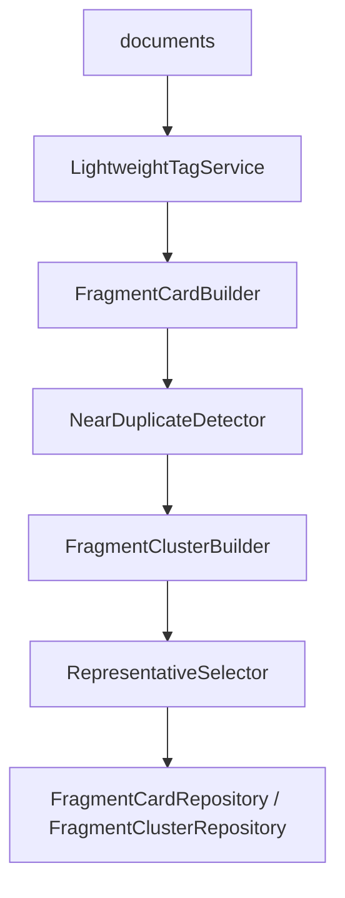
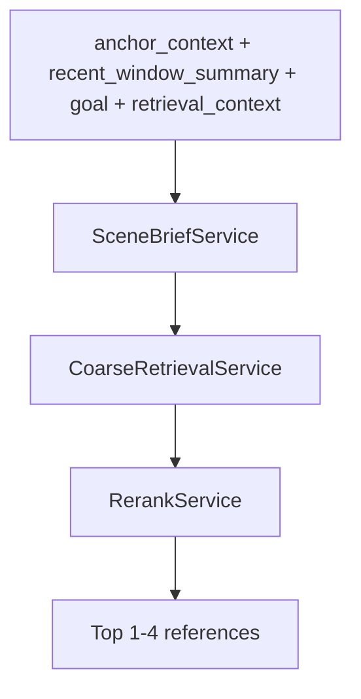

# 创作知识库实现设计稿

## 1. 目标
本设计稿把 [creative-knowledge-base/spec.md](.trae/specs/creative-knowledge-base/spec.md) 进一步细化到可编码实现的程度，重点回答：

- `fragment_cards` / `fragment_clusters` 如何落到 SQLite
- `SceneBrief` / 粗筛 / rerank 的 JSON contract 如何固定
- Agent / service / repo 如何分层
- 旧基础检索工具与旧 `ScenePlan` 如何兼容过渡

本稿默认遵循以下约束：

- 不引入重量级向量库作为第一阶段前置条件
- 以本地 `SQLite + FTS5 + 结构化卡片` 为主
- 轻量标签只作辅助，不作主排序依据
- 在线阶段只在小候选集上做高精度 rerank

## 2. 模块边界

### 2.1 输入

- 来自主编排层的 `documents`
- 可选的基础检索结果：
  - `search_by_character`
  - `search_lore`
  - `search_by_timeline`
- 来自续写主 Agent 的：
  - `anchor_context`
  - `recent_window_summary`
  - `goal`
  - `previous_generated_segment`

### 2.2 输出

- `fragment_cards`
- `fragment_clusters`
- `SceneBrief`
- 粗筛结果
- rerank 结果

### 2.3 不负责

- 人物档案
- 世界观
- 章节摘要
- 正文生成

### 2.4 关键概念与身份边界

#### `SceneBrief`

- `SceneBrief` 是创作知识库层的检索意图对象
- 它回答“当前续写片段要检索什么样的参考桥段”，而不是“正文该怎么写完”
- 它的职责是把上游较复杂的故事梗概、锚点上下文、最近窗口和当前目标压缩成稳定可检索的查询画像

#### `retrieval_context`

- `retrieval_context` 是基础检索工具返回的辅助上下文摘要
- 其来源包括：
  - `search_by_character`
  - `search_lore`
  - `search_by_timeline`
- 它只用于辅助 `SceneBrief` 构造或在线检索阶段的过滤提示
- 它不是桥段主检索入口，不得直接生成最终参考桥段

#### `Retrieval Agent`

- `Retrieval Agent` 是创作知识库层的在线执行器
- 它接收 `SceneBrief`，并在 `fragment_cards` / `fragment_clusters` 上执行：
  - 粗筛
  - cluster 去重
  - rerank
- 它不负责正文生成，不负责装配 `WriterInputBundle`，也不是主编排入口

#### `fragment_id` / `doc_id` / `cluster_id`

- `fragment_id`：创作知识库内部的片段主键，也是在线检索最终选中结果的主键
- `doc_id`：共享 `documents` 基线中的主键，用于从知识库结果回源到原始 `document`
- `cluster_id`：近重复归并后的簇主键，只用于去重与代表片段约束，不作为 Writer 默认直接消费的主键

#### `documents` 去重策略

- 总编排层的 `documents` 是共享输入基线
- 创作知识库层不对 `documents` 做物理删除、覆盖或主键级去重
- 所谓“去重”只发生在创作知识库内部：
  - 为每个 `document` 建 1 张 `fragment_card`
  - 再用 `fragment_cluster` 表达近重复关系
  - 在线阶段优先 representative，限制同簇重复占位

## 3. SQLite 设计

### 3.1 `fragment_cards`

```sql
CREATE TABLE IF NOT EXISTS fragment_cards (
    fragment_id TEXT PRIMARY KEY,
    doc_id TEXT NOT NULL,
    document_title TEXT NOT NULL,
    document_title_index TEXT NOT NULL,
    cluster_id TEXT,
    is_cluster_representative INTEGER NOT NULL DEFAULT 0,
    source_path TEXT NOT NULL,
    source_offset_start INTEGER NOT NULL,
    source_offset_end INTEGER NOT NULL,
    source_excerpt TEXT NOT NULL,
    content_summary TEXT NOT NULL,
    narrative_function_json TEXT NOT NULL,
    narrative_function_text TEXT NOT NULL,
    scene_space_tags_json TEXT NOT NULL,
    event_tags_json TEXT NOT NULL,
    emotion_tags_json TEXT NOT NULL,
    emotion_mechanism_text TEXT NOT NULL,
    expression_mode_tags_json TEXT NOT NULL,
    preferred_tags_json TEXT NOT NULL,
    pov_mode TEXT NOT NULL,
    character_focus_json TEXT NOT NULL,
    character_temperament_json TEXT NOT NULL,
    character_relation_text TEXT NOT NULL,
    relationship_state_json TEXT NOT NULL,
    continuity_phase TEXT NOT NULL,
    style_features_json TEXT NOT NULL,
    style_profile_text TEXT NOT NULL,
    transferability_score REAL NOT NULL,
    context_dependency_level TEXT NOT NULL,
    created_at TEXT NOT NULL,
    updated_at TEXT NOT NULL,
    FOREIGN KEY(doc_id) REFERENCES documents(doc_id)
);
```

### 3.2 `fragment_clusters`

```sql
CREATE TABLE IF NOT EXISTS fragment_clusters (
    cluster_id TEXT PRIMARY KEY,
    cluster_theme TEXT NOT NULL,
    representative_fragment_id TEXT NOT NULL,
    member_count INTEGER NOT NULL,
    dedup_reason TEXT NOT NULL,
    created_at TEXT NOT NULL,
    updated_at TEXT NOT NULL,
    FOREIGN KEY(representative_fragment_id) REFERENCES fragment_cards(fragment_id)
);
```

### 3.3 索引建议

```sql
CREATE INDEX IF NOT EXISTS idx_fragment_cards_doc_id
ON fragment_cards(doc_id);

CREATE INDEX IF NOT EXISTS idx_fragment_cards_cluster_id
ON fragment_cards(cluster_id);

CREATE INDEX IF NOT EXISTS idx_fragment_cards_title_index
ON fragment_cards(document_title_index);

CREATE INDEX IF NOT EXISTS idx_fragment_cards_representative
ON fragment_cards(is_cluster_representative);

CREATE INDEX IF NOT EXISTS idx_fragment_clusters_representative_fragment_id
ON fragment_clusters(representative_fragment_id);
```

### 3.4 FTS5 设计

第一阶段建议单独建立 FTS 表，而不是把所有字段都塞进主表查询。

```sql
CREATE VIRTUAL TABLE IF NOT EXISTS fragment_cards_fts
USING fts5(
    fragment_id UNINDEXED,
    content_summary,
    narrative_function_text,
    emotion_mechanism_text,
    character_relation_text,
    style_profile_text,
    preferred_tags_text,
    content='',
    tokenize='unicode61'
);
```

### 3.5 字段编码约定

- 所有数组字段使用 JSON 字符串落库：
  - `narrative_function_json`
  - `scene_space_tags_json`
  - `event_tags_json`
  - `emotion_tags_json`
  - `expression_mode_tags_json`
  - `preferred_tags_json`
  - `character_focus_json`
  - `character_temperament_json`
  - `relationship_state_json`
- `style_features_json` 保存扁平对象
- `preferred_tags_text` 为给 FTS 用的派生字段，可用空格拼接的 tag 文本生成

## 4. Python Schema 设计

### 4.1 `FragmentCard`

```python
from pydantic import BaseModel, Field
from typing import Literal


class StyleFeatures(BaseModel):
    sentence_rhythm: str
    dialogue_density: str
    interiority_density: str
    imagery_density: str


class FragmentCard(BaseModel):
    fragment_id: str
    doc_id: str
    document_title: str
    document_title_index: str
    cluster_id: str | None = None
    is_cluster_representative: bool = False
    source_path: str
    source_offsets: tuple[int, int]
    source_excerpt: str
    content_summary: str
    narrative_function: list[str]
    narrative_function_text: str
    scene_space_tags: list[str]
    event_tags: list[str]
    emotion_tags: list[str]
    emotion_mechanism_text: str
    expression_mode_tags: list[str]
    preferred_tags: list[str]
    pov_mode: str
    character_focus: list[str]
    character_temperament: list[str]
    character_relation_text: str
    relationship_state: list[str]
    continuity_phase: str
    style_features: StyleFeatures
    style_profile_text: str
    transferability_score: float = Field(ge=0.0, le=1.0)
    context_dependency_level: Literal["low", "medium", "high"]
```

### 4.2 `FragmentCluster`

```python
class FragmentCluster(BaseModel):
    cluster_id: str
    cluster_theme: str
    representative_fragment_id: str
    member_count: int
    dedup_reason: str
```

### 4.3 `SceneBrief`

```python
class SceneBrief(BaseModel):
    scene_objective: str
    emotional_goal: str
    conflict_goal: str
    narrative_function: list[str]
    emotion_mode: list[str]
    character_temperament: list[str]
    relationship_state: list[str]
    style_need: list[str]
    must_avoid: list[str]
    preferred_tags: list[str]
```

### 4.4 `CoarseCandidate`

```python
class CoarseCandidate(BaseModel):
    fragment_id: str
    cluster_id: str | None = None
    matched_by: list[str]
    coarse_score: float
```

### 4.5 `RerankScore`

```python
class RerankScore(BaseModel):
    candidate_id: str
    cluster_id: str | None = None
    continuity_fit: int = Field(ge=0, le=10)
    scene_function_fit: int = Field(ge=0, le=10)
    character_temperament_fit: int = Field(ge=0, le=10)
    relationship_state_fit: int = Field(ge=0, le=10)
    emotion_expression_fit: int = Field(ge=0, le=10)
    style_fit: int = Field(ge=0, le=10)
    transferability: int = Field(ge=0, le=10)
    context_dependency_penalty: int = Field(ge=0, le=10)
    final_score: float
    reason: str
```

## 5. 离线流水线设计

### 5.1 流程



### 5.2 阶段说明

#### 阶段 1: LightweightTagService
- 输入：`document.content`、`document_title`
- 输出：最多 4 个高置信 tag
- 原则：
  - 不调用高成本模型即可完成初筛
  - 优先保留场景/事件/情绪/描写方式四类中的高置信项

#### 阶段 2: FragmentCardBuilder
- 输入：`document` + `preferred_tags`
- 输出：首版 `FragmentCard`
- 实现方式：
  - 调用结构化 JSON 模型
  - 强制 schema 校验
  - 失败可重试 1-2 次
- 约束：
  - 建卡粒度固定为 `document`
  - 每个 `document` 恰好对应 1 张 `fragment_card`
  - 不按 `chapter` 聚合建卡

建议接口草案：

```python
def build_fragment_card(
    document: DocumentRecord,
    preferred_tags: list[str],
) -> FragmentCardBuildResult: ...
```

主路径：

```text
prompt 调用
-> JSON 解析
-> schema 校验
-> 字段后处理
-> 成功落库
```

重试策略：

- 首次失败后允许按同一固定 prompt 重试 `1-2` 次
- 重试仅用于修复结构化问题：
  - JSON 非法
  - 字段缺失
  - schema 校验失败
- 重试阶段不得自由切换另一套 prompt 语义，不得把“补结构”变成“重做任务定义”

deterministic fallback 策略：

- 若模型建卡连续失败，可进入 deterministic fallback
- fallback 目标是生成“最小可用卡片”，而不是伪装成高质量正常建卡结果
- fallback 至少保留：
  - `doc_id`
  - `source_path`
  - `source_offsets`
  - `source_excerpt`
  - 清洗后的 `preferred_tags`
- fallback 可规则化补出：
  - 最小 `content_summary`
  - 保守的 `narrative_function_text`
  - 保守的 `style_profile_text`
- 对证据不足字段：
  - 数组字段优先空数组
  - 文本字段优先保守短句
  - `transferability_score` 应取低值
  - `context_dependency_level` 应取保守值
- fallback 卡片必须带显式标记，便于后续重建或人工复核

失败落库策略：

- 区分三种状态：
  - `success`
  - `fallback_success`
  - `failed`
- `success` 与 `fallback_success` 可以进入 `fragment_cards`
- `failed` 不写入正式 `fragment_cards`
- 但 `failed` 必须进入构建结果统计与失败记录
- 失败记录至少应包含：
  - `doc_id`
  - `failure_stage`
  - `failure_reason`
  - `retry_count`
  - `last_error_summary`

建议结果对象：

```json
{
  "status": "success | fallback_success | failed",
  "fragment_card": {},
  "retry_count": 0,
  "used_fallback": false,
  "failure_stage": "json_parse | schema_validate | postprocess | persist | null",
  "failure_reason": "string | null",
  "warnings": ["string"]
}
```

#### 阶段 3: NearDuplicateDetector
- 输入：一批首版 `FragmentCard`
- 输出：近重复候选对
- 第一阶段建议规则：
  - 先按 `preferred_tags` / `narrative_function` / `continuity_phase` 粗分桶
  - 只在桶内比较，避免全量 N^2
  - 同时比较：
    - `content_summary`
    - `emotion_mechanism_text`
    - `style_profile_text`

#### 阶段 4: FragmentClusterBuilder
- 输入：近重复候选对
- 输出：`FragmentCluster`
- 说明：
  - 第一阶段可采用并查集或图连通分量实现
  - 单节点也可以视为单成员 cluster，便于统一在线逻辑

#### 阶段 5: RepresentativeSelector
- 输入：同一 cluster 内的多个 `FragmentCard`
- 输出：代表片段 ID
- 默认评分：

```text
rep_score =
  0.40 * transferability_score
  + 0.25 * completeness_score
  + 0.20 * style_representativeness_score
  - 0.15 * context_dependency_penalty
```

## 6. 近重复检测细则

### 6.1 可复用的简单实现

第一阶段不做 embedding 去重，先做规则化近重复检测：

1. 预分桶：
   - `continuity_phase`
   - `narrative_function`
   - `preferred_tags`
2. 比较文本字段：
   - `content_summary`
   - `emotion_mechanism_text`
   - `style_profile_text`
3. 若三类文本整体高度接近，视为候选近重复

### 6.2 明确不合并条件

出现以下任一情况时直接判为不可合并：

- `character_temperament` 差异明显
- `relationship_state` 差异明显
- `emotion_mechanism_text` 呈现相反表达方式
- `style_profile_text` 对应不同用途：
  - 一个是对白推进
  - 一个是心理深描
  - 一个是环境映射

### 6.3 `dedup_reason` 模板

建议存短句，不存长段分析：

- `same_narrative_function_and_emotion_mechanism`
- `same_style_pattern_with_minor_entity_changes`
- `same_grief_expression_with_location_variation`

## 7. 在线检索设计

### 7.1 总流程



补充说明：

- `SceneBrief` 的生成主依据是故事梗概、锚点上下文、最近窗口与当前目标
- `retrieval_context` 只作为辅助输入进入 `SceneBriefService`
- `Retrieval Agent` 的默认执行路径为：`SceneBrief -> 粗筛 -> rerank`
- 基础检索工具不得绕过 `fragment_cards` / `fragment_clusters`，直接输出最终参考桥段

### 7.2 `SceneBriefService`

职责：
- 把当前续写目标变成结构化检索意图
- 接受旧 `ScenePlan` 子集作为兼容输入
- 将基础检索工具结果整理为辅助性的 `retrieval_context`

边界：

- `SceneBriefService` 负责生成“检索什么”
- 它不负责生成正文任务卡，也不负责直接选择最终参考片段

输入：

```json
{
  "anchor_context": "string",
  "recent_window_summary": "string",
  "goal": "string",
  "previous_generated_segment": "string | null",
  "retrieval_context": {
    "character_hits": ["string"],
    "timeline_hits": ["string"],
    "lore_hits": ["string"]
  }
}
```

输出：

```json
{
  "scene_objective": "string",
  "emotional_goal": "string",
  "conflict_goal": "string",
  "narrative_function": ["string"],
  "emotion_mode": ["string"],
  "character_temperament": ["string"],
  "relationship_state": ["string"],
  "style_need": ["string"],
  "must_avoid": ["string"],
  "preferred_tags": ["string"]
}
```

### 7.3 `CoarseRetrievalService`

职责：
- 在不调用高成本 rerank 前，把候选压缩到 `12-40`

输入：
- `SceneBrief`
- `fragment_cards`
- `fragment_clusters`
- 可选 FTS 命中

粗筛优先级建议：

1. 先做硬过滤：
   - `pov_mode`
   - `relationship_state`
   - `continuity_phase`
2. 再做 FTS / 标签 / 关键文本字段混合命中：
   - `content_summary`
   - `narrative_function_text`
   - `emotion_mechanism_text`
   - `style_profile_text`
3. 最后做 cluster 去重：
   - 默认同簇仅保留代表片段
   - 除非代表片段缺失，才允许非代表片段顶替

输出：

```json
{
  "candidate_fragment_ids": ["string"],
  "matched_by": {
    "fragment_id_1": ["fts", "preferred_tags"],
    "fragment_id_2": ["emotion_mechanism_text"]
  },
  "filtered_cluster_ids": ["string"],
  "coarse_scores": {
    "fragment_id_1": 0.88,
    "fragment_id_2": 0.73
  }
}
```

补充规则：

- `candidate_fragment_ids` 必须是 `fragment_id`
- `retrieval_context` 可以帮助上游构造 `SceneBrief` 或参与过滤提示，但不得直接生成 `candidate_fragment_ids`
- cluster 去重默认优先保留代表片段；若某簇代表片段缺失，再考虑该簇非代表片段补位

### 7.4 `RerankService`

职责：
- 对小候选集做固定 rubric 评分
- 输出最终 `1-4` 段参考

输入：

```json
{
  "scene_brief": {},
  "anchor_context": "string",
  "recent_window_summary": "string",
  "candidates": [
    {
      "fragment_id": "string",
      "cluster_id": "string",
      "source_excerpt": "string",
      "content_summary": "string",
      "narrative_function_text": "string",
      "emotion_mechanism_text": "string",
      "character_relation_text": "string",
      "style_profile_text": "string",
      "transferability_score": 0.82,
      "context_dependency_level": "medium"
    }
  ]
}
```

输出：

```json
{
  "scores": [
    {
      "candidate_id": "string",
      "cluster_id": "string",
      "continuity_fit": 8,
      "scene_function_fit": 9,
      "character_temperament_fit": 8,
      "relationship_state_fit": 7,
      "emotion_expression_fit": 9,
      "style_fit": 8,
      "transferability": 8,
      "context_dependency_penalty": 2,
      "final_score": 47.5,
      "reason": "更适合作为当前段的克制型悲伤写法参照"
    }
  ],
  "selected_fragment_ids": ["string"],
  "selection_notes": "主锚点 1 段，辅锚点 1 段"
}
```

主键与回源规则：

- `selected_fragment_ids` 的元素类型固定为 `fragment_id`
- `cluster_id` 仅用于同簇去重约束与结果解释，不替代最终选中主键
- 通过 `fragment_id -> doc_id -> documents` 可以回源到原始 `document`
- Writer 默认不直接消费 `cluster_id`，而是消费由 `selected_fragment_ids` 展开的参考片段内容

## 8. Prompt 设计

### 8.1 `fragment_card` 生成 prompt

系统要求：

- 只输出 JSON
- 标签只能从给定词典中选择
- 无证据则留空数组，不编造
- 风格字段必须写成可检索短句，不写大段文学评论

建议骨架：

```text
任务：为下面的小说片段生成结构化 fragment_card，用于桥段检索与仿写参考。

要求：
1. 只输出 JSON。
2. 不要复述过长原文。
3. narrative_function_text、emotion_mechanism_text、character_relation_text、style_profile_text 都要写成 1-2 句可检索描述。
4. preferred_tags 只能从标签词典中选择，最多 4 个。
5. transferability_score 取值 0-1。
6. context_dependency_level 只能是 low / medium / high。
7. 若证据不足，不要编造。
```

补充约束：

- `transferability_score` 评分语义固定为：
  - `0.0-0.2`：高度依赖专有上下文，几乎不可迁移
  - `0.3-0.5`：可借鉴局部写法，但用途较窄
  - `0.6-0.8`：桥段机制稳定，可直接作为参考
  - `0.9-1.0`：高可迁移写法锚点，适合作为仿写参照
- `context_dependency_level` 语义固定为：
  - `low`：脱离前文仍可理解桥段用途
  - `medium`：需要少量上下文辅助
  - `high`：强依赖前情、人物关系或专有设定
- `preferred_tags` 最终落库值以 `documents.content_tags` 的轻量标签清洗结果为准；模型输出只用于校验是否遵循预定义词典，不作为最终覆盖来源
- 建卡服务在 JSON 可解析后仍必须执行字段级 schema 校验；若校验失败，应按同一固定 prompt 重试 `1-2` 次
- 若重试后仍失败，应进入 deterministic fallback 或失败记录路径，不得静默丢弃 `document`

### 8.2 `SceneBrief` prompt

系统要求：

- 目标是定义检索意图，不是写作
- 要求明确当前小段“要干什么”和“不能干什么”

建议骨架：

```text
任务：根据锚点上下文、最近窗口摘要、当前目标和已有检索线索，输出 SceneBrief。

要求：
1. 只输出 JSON。
2. narrative_function、emotion_mode、style_need 应优先服务于桥段检索。
3. must_avoid 填写当前小段不应误入的方向。
4. preferred_tags 最多 4 个，只能从标签词典中选择。
```

### 8.3 rerank prompt

系统要求：

- 固定 rubric 打分
- 不自由发挥
- 先评分后排序

建议骨架：

```text
任务：根据 SceneBrief 和候选 fragment_card，为每个候选按固定 rubric 评分。

要求：
1. 只输出 JSON。
2. 每个维度 0-10 分。
3. context_dependency_penalty 是惩罚项。
4. final_score 必须体现惩罚项。
5. 最终只推荐 1-4 个候选。
6. 同一 cluster 不应重复占用多个参考位，除非确有必要。
```

## 9. Service / Repository 接口

### 9.1 Repository

#### `FragmentCardRepository`

```python
class FragmentCardRepository:
    def upsert_cards(self, cards: list[FragmentCard]) -> None: ...
    def get_by_doc_ids(self, doc_ids: list[str]) -> list[FragmentCard]: ...
    def get_by_fragment_ids(self, fragment_ids: list[str]) -> list[FragmentCard]: ...
    def list_representatives(self) -> list[FragmentCard]: ...
    def mark_cluster_membership(
        self,
        fragment_id: str,
        cluster_id: str,
        is_representative: bool,
    ) -> None: ...
```

#### `FragmentClusterRepository`

```python
class FragmentClusterRepository:
    def upsert_clusters(self, clusters: list[FragmentCluster]) -> None: ...
    def get_by_cluster_ids(self, cluster_ids: list[str]) -> list[FragmentCluster]: ...
    def get_representative_fragment_id(self, cluster_id: str) -> str | None: ...
```

### 9.2 Services

#### `FragmentCardBuilderService`
- 输入：`DocumentRecord`
- 输出：`FragmentCard`

#### `NearDuplicateDetectionService`
- 输入：`list[FragmentCard]`
- 输出：`list[tuple[fragment_id_a, fragment_id_b]]`

#### `FragmentClusterService`
- 输入：cards + duplicate pairs
- 输出：clusters + 回填后的 cards

#### `SceneBriefService`
- 输入：锚点、最近窗口、goal、基础检索上下文
- 输出：`SceneBrief`

#### `CoarseRetrievalService`
- 输入：`SceneBrief`
- 输出：`list[CoarseCandidate]`

#### `RerankService`
- 输入：`SceneBrief` + 候选 cards
- 输出：`list[RerankScore]`

#### `CreativeKnowledgeBaseFacade`
- 输入：`documents`
- 输出：`fragment_cards`、`fragment_clusters`
- 职责：编排建卡、近重复归并与代表片段选择
- 边界：只提供 service-level facade，不作为新的主 Runner / CLI 入口

建议接口草案：

```python
def build_creative_kb(
    documents: list[DocumentRecord],
) -> CreativeKBBuildResult: ...
```

补充说明：

- 输入主语义是共享 `documents` 基线
- facade 不接管粗读入口，只消费已存在的 `documents`
- facade 只编排 Task 5/6/7 对应的内部 service，不重写其核心规则

建议返回对象：

```json
{
  "built_fragment_count": 0,
  "built_cluster_count": 0,
  "representative_count": 0,
  "fragment_ids": ["string"],
  "cluster_ids": ["string"],
  "failed_doc_ids": ["string"],
  "skipped_doc_ids": ["string"],
  "warnings": ["string"]
}
```

字段说明：

- `failed_doc_ids`：尝试建卡但最终失败的 `document` 集合，例如 schema 校验连续失败或必要字段缺失
- `skipped_doc_ids`：本轮未进入建卡或被显式跳过的 `document` 集合，例如空内容、重复执行时命中跳过策略或不满足最小长度阈值
- `warnings`：非阻塞性提示，例如部分 `document` 降级处理、少量 cluster 无 representative 需人工复核等

#### `RetrievalFacade`
- 输入：`SceneBrief`、可选 `retrieval_context`
- 输出：`RerankResult`，以及可选的已展开参考片段信息
- 职责：编排 `CoarseRetrievalService` + `RerankService`
- 边界：核心结果仍以 `selected_fragment_ids` 为准，不越权装配 `WriterInputBundle`

建议接口草案：

```python
def retrieve_reference_fragments(
    scene_brief: SceneBrief,
    retrieval_context: RetrievalContext | None = None,
) -> CreativeKBRetrievalResult: ...
```

补充说明：

- 主执行路径固定为：`SceneBrief -> CoarseRetrievalService -> RerankService`
- `retrieval_context` 仅作辅助输入或过滤提示
- `retrieval_context` 不得绕过主路径直接返回参考桥段

建议返回对象：

```json
{
  "scene_brief": {},
  "coarse_result": {},
  "rerank_result": {},
  "reference_fragments": [
    {
      "fragment_id": "string",
      "doc_id": "string",
      "source_path": "string",
      "source_excerpt": "string",
      "content_summary": "string",
      "style_profile_text": "string"
    }
  ]
}
```

返回规则：

- `CreativeKBRetrievalResult` 的默认最小稳定返回为：`scene_brief + rerank_result`
- `rerank_result` 仍是对外核心 contract
- `coarse_result` 是可选的调试/验收字段
- `coarse_result` 不属于默认主流程返回字段
- 仅在需要观测粗筛行为、解释候选来源、排查召回问题或执行验收测试时返回
- `reference_fragments` 是可选的便利展开结果，供主编排层或 Writer 使用
- `reference_fragments` 不属于强制默认返回字段
- 当调用方只需要稳定检索结果时，只返回 `rerank_result` 即可
- 当调用方需要直接消费范文内容时，facade 可额外展开 `reference_fragments`
- 若未返回 `reference_fragments`，调用方应通过 `selected_fragment_ids -> fragment_cards -> doc_id/source_excerpt` 自行展开
- `reference_fragments` 不替代 `RerankResult`
- facade 不负责装配 `WriterInputBundle`
- facade 不负责修改共享 `documents` 基线

## 10. 兼容迁移策略

### 10.1 基础检索工具

- 保留：
  - `search_by_character`
  - `search_lore`
  - `search_by_timeline`
- 新定位：
  - 只产出 `retrieval_context`
  - 可参与 `SceneBrief` 构造或过滤提示
  - 不直接决定最终参考桥段

建议适配接口：

```python
def build_retrieval_context(
    character_hits: list[str],
    timeline_hits: list[str],
    lore_hits: list[str],
) -> RetrievalContext: ...
```

```python
def prepare_scene_brief_input(
    anchor_context: str,
    recent_window_summary: str,
    goal: str,
    previous_generated_segment: str | None,
    retrieval_context: RetrievalContext | None,
) -> SceneBriefInput: ...
```

边界规则：

- `build_retrieval_context()` 只负责标准化基础检索工具结果
- 它不负责生成 `SceneBrief`
- 它不负责直接生成候选桥段
- `retrieval_context` 允许影响：
  - `SceneBrief` 构造
  - 可选过滤提示
  - 调试解释信息
- `retrieval_context` 禁止影响：
  - 不得直接生成 `candidate_fragment_ids`
  - 不得绕过 `fragment_cards` / `fragment_clusters`
  - 不得单独决定 `selected_fragment_ids`

验收建议：

- 若 `fragment_cards` 主路径无有效命中，不允许仅依赖 `retrieval_context` 输出最终参考桥段
- 相同 `retrieval_context`、不同 `SceneBrief` 时，结果应仍主要由 `SceneBrief` 与 `fragment_cards` 主路径决定
- 调试信息可解释 `retrieval_context` 的辅助作用，但最终结果必须可追溯到 `fragment_cards -> coarse -> rerank`

### 10.2 旧 `ScenePlan`

- 旧 `ScenePlan` 子集继续保留
- 过渡期策略：
  - 若存在新 `SceneBrief`，优先使用 `SceneBrief`
  - 若仅存在旧 `ScenePlan`，用字段映射补出最小 `SceneBrief`

建议适配接口：

```python
def adapt_scene_plan_to_scene_brief(
    scene_plan: ScenePlanSubset,
) -> SceneBrief: ...
```

```python
def resolve_scene_brief(
    scene_brief: SceneBrief | None,
    scene_plan: ScenePlanSubset | None,
) -> SceneBrief: ...
```

兼容规则：

- 若显式提供 `SceneBrief`，必须优先使用 `SceneBrief`
- 仅在缺失 `SceneBrief` 时，才允许使用旧 `ScenePlan` 子集补出最小可用 `SceneBrief`
- 适配器只负责字段映射与最小补齐
- 适配器不得修改 [`contracts.md`](.trae/specs/novel-continuation-mvp/contracts.md) 中已冻结的 `SceneBrief` 字段语义
- 适配器不得把旧 `ScenePlan` 重新抬升为在线检索主入口

最小兼容输出要求：

- `scene_objective`
- `narrative_function`
- `emotion_mode`
- `must_avoid`

建议映射：

```text
ScenePlan.goal -> SceneBrief.scene_objective
ScenePlan.emotional_goal -> SceneBrief.emotional_goal
ScenePlan.conflict_goal -> SceneBrief.conflict_goal
ScenePlan.style_reference_query.narrative_function -> SceneBrief.narrative_function
ScenePlan.style_reference_query.emotion_mode -> SceneBrief.emotion_mode
ScenePlan.style_reference_query.character_temperament -> SceneBrief.character_temperament
ScenePlan.forbidden + ScenePlan.avoidance_items -> SceneBrief.must_avoid
ScenePlan.retrieval_hints.preferred_tags -> SceneBrief.preferred_tags
```

验收建议：

- 同时提供 `SceneBrief` 与旧 `ScenePlan` 时，系统必须优先使用 `SceneBrief`
- 仅提供旧 `ScenePlan` 子集时，系统必须通过 runtime adapter 产出 contract 兼容的 `SceneBrief`
- 不接受只有映射文档、没有 runtime adapter 与测试的实现

## 11. Creative KB Benchmark 设计

### 11.1 目标与边界

Creative KB benchmark 用于回答三个互相关联但必须分开观测的问题：

1. 建库质量：`fragment_card` / `fragment_cluster` 是否忠实、可检索、可迁移。
2. 检索质量：`SceneBrief -> coarse -> rerank` 是否能把正确参考排到 top `1-4`。
3. 写作增益：使用 KB references 的 Writer 是否优于无 KB 或错误 KB references 的 Writer。

其中检索 / rerank 质量是 Creative KB benchmark 的主评测层。  
Writer A/B 是增益诊断层，不能替代检索 / rerank 主结论。

### 11.2 服务拆分

建议新增 `CreativeKBBenchmarkService`，只负责 benchmark 编排，不替代 `CreativeKnowledgeBaseFacade` 或 `RetrievalFacade`。

建议职责：

```text
CreativeKBBenchmarkService
  -> build windows / load fixture
  -> run real read pipeline and CreativeKnowledgeBaseFacade
  -> build SceneBrief benchmark cases
  -> run RetrievalFacade for each case
  -> build decoy set for each case
  -> run KBRetrievalReviewer
  -> optionally run Writer A/B variants
  -> write summary.json and kb_reviewer_report.json
```

建议辅助对象：

```text
KBBenchmarkCase
  - case_id
  - anchor_context
  - recent_window_summary
  - goal
  - scene_brief
  - reference_synopsis
  - expected_traits

KBRetrievalReviewReport
  - decision
  - score
  - summary
  - checks
  - selected_fragment_ids
  - decoy_fragment_ids
  - issues

KBWriterABReport
  - decision
  - score
  - winner
  - variant_scores
  - negative_transfer_issues
```

### 11.3 Benchmark 数据流

推荐 MVP 数据流：

```text
longzu_32kb.txt or user source
  -> split prefix / held-out windows
  -> real segmentation / close-read on prefix
  -> real Creative KB build on prefix documents
  -> construct 3-5 SceneBrief cases
  -> RetrievalFacade(scene_brief, include_coarse_result=True, expand_reference_fragments=True)
  -> add decoy fragments
  -> LLM KBRetrievalReviewer
  -> aggregate kb_reviewer_report.json
  -> optional Writer A/B
```

SceneBrief cases 可以来自：

- held-out reference truth 的 close-read synopsis
- prefix close-read 章节摘要中的下一段目标
- 手写的稳定 smoke query
- Writer benchmark 中已构造的 reference story synopsis

MVP 可以先用 `3` 个 case，分别覆盖：

- 情绪停顿 / 关系收束
- 冲突升级 / 行动推进
- 信息揭示 / 设定承接

### 11.4 Rerank 质量评价方式

Rerank 不做绝对文学评分，而做相对排序判断。  
Reviewer 的问题不是“这段写得好吗”，而是：

```text
对于这个 SceneBrief，系统选出的 top references 是否比 decoy 更适合作为桥段参考？
```

每个 retrieval case 的 Reviewer 输入应包含：

```json
{
  "scene_brief": {},
  "anchor_context": "string",
  "recent_window_summary": "string",
  "selected_references": [],
  "rerank_scores": [],
  "decoy_references": [],
  "rejected_high_score_references": []
}
```

Reviewer 固定 rubric：

- `top1_beats_decoys`: top1 是否明显优于 decoy
- `selected_fragments_match_scene_brief`: top `1-4` 是否匹配 SceneBrief
- `scene_function_fit`: 叙事功能是否匹配
- `emotion_mechanism_fit`: 情绪机制是否匹配
- `relationship_state_fit`: 关系阶段是否匹配
- `style_reference_value`: 是否有明确风格参考价值
- `transferability`: 是否可迁移到当前场景
- `cluster_diversity`: 是否避免同簇重复占位
- `context_dependency_risk`: 是否过度依赖原上下文
- `negative_transfer_risk`: 是否可能把 Writer 带向错误剧情或错误关系阶段

### 11.5 Decoy 构造策略

Decoy 的作用是降低主观性，让 Reviewer 做相对判断。

每个 case SHOULD 构造：

- `random_decoy`: 从 KB 中随机选一个非 selected fragment
- `same_cluster_decoy`: selected top1 的同 cluster sibling，用于测试 representative 选择是否合理
- `tag_similar_decoy`: preferred tags 相似但关系阶段或情绪机制不匹配
- `high_dependency_decoy`: `context_dependency_level=high` 但表面相关
- `rejected_high_score`: coarse 或 rerank 中分数较高但未入选的候选

若某类 decoy 不存在，可以省略，但 `decoy_fragments` 不应为空。

### 11.6 Reviewer 输出聚合

单 case report：

```json
{
  "case_id": "case-001",
  "decision": "pass",
  "score": 0.67,
  "summary": "top references 能提供克制型停顿写法参考，但第二个片段上下文依赖偏高。",
  "checks": {
    "top1_beats_decoys": "pass",
    "selected_fragments_match_scene_brief": "pass",
    "scene_function_fit": "pass",
    "emotion_mechanism_fit": "pass",
    "relationship_state_fit": "borderline",
    "style_reference_value": "pass",
    "transferability": "borderline",
    "cluster_diversity": "pass",
    "context_dependency_risk": "borderline",
    "negative_transfer_risk": "pass"
  },
  "selected_fragment_ids": ["fragment-1", "fragment-7"],
  "decoy_fragment_ids": ["fragment-9", "fragment-12"],
  "issues": []
}
```

顶层 `kb_reviewer_report.json`：

```json
{
  "decision": "pass",
  "score": 0.64,
  "summary": "3 个 case 中 2 个通过，1 个 borderline；主要风险是上下文依赖片段偶尔进入第二参考位。",
  "case_reports": [],
  "aggregate_checks": {
    "empty_kb": "pass",
    "empty_selection": "pass",
    "rerank_relevance": "pass",
    "cluster_diversity": "pass",
    "negative_transfer_risk": "borderline"
  }
}
```

聚合建议：

- 空 KB 或所有 case 空选中直接 `fail`
- 单 case `score` 简单平均作为基础分
- 若任一 case top1 明显输给 decoy，顶层最多 `borderline`
- 若多个 case 出现高上下文依赖误排，顶层最多 `borderline`
- Writer A/B 只作为附加诊断字段，不覆盖 retrieval 主分

### 11.7 Writer A/B 复用方案

Writer A/B SHOULD 复用 `AgenticSmokeBenchmarkService` 的能力：

- source window split
- prefix close-read
- reference story synopsis
- Writer execution
- ExpansionReviewer

但必须增加 KB variant 控制。当前 Agentic smoke 默认会在 prefix pipeline 中 `build_creative_kb=True`，并且 Writer execution input 通常包含 `style_reference_bundle`，所以它是 `kb_enabled`，不是 no-KB baseline。

建议 variant 实现方式：

```text
kb_enabled
  - 保持现有 AgenticSmokeBenchmarkService 行为

kb_disabled
  - build_creative_kb=False
  - 或在 prepare_execution 后清空 style_reference_bundle.references
  - selected_fragment_ids=[]

kb_random
  - 正常构建 KB
  - 在 execution input 中替换为随机 / decoy reference fragments
  - 标记 selected_fragment_ids 来源为 random_decoy

kb_oracle
  - 可选诊断上限
  - 使用人工或 held-out reference 近邻构造的理想参考
  - 不计入 canonical smoke pass/fail
```

A/B Reviewer 输入：

```json
{
  "reference_story_synopsis": {},
  "reference_truth": "optional string",
  "variants": {
    "kb_enabled": {
      "draft": "string",
      "selected_fragment_ids": [],
      "reference_fragment_summaries": []
    },
    "kb_disabled": {
      "draft": "string",
      "selected_fragment_ids": [],
      "reference_fragment_summaries": []
    },
    "kb_random": {
      "draft": "string",
      "selected_fragment_ids": [],
      "reference_fragment_summaries": []
    }
  }
}
```

A/B Reviewer 检查：

- synopsis coverage
- recent window coherence
- emotion mechanism quality
- relationship state fit
- style stability
- negative transfer from references
- winner: `kb_enabled | kb_disabled | kb_random | tie`

### 11.8 产物目录

建议目录：

```text
runs/creative_kb_benchmarks/<run_id>/
  source_prefix.txt
  reference_truth.txt
  kb_build_result.json
  fragment_cards_sample.json
  fragment_clusters_sample.json
  scene_brief_cases.json
  retrieval_cases/
    case-001/
      scene_brief.json
      coarse_result.json
      rerank_result.json
      selected_reference_fragments.json
      decoy_fragments.json
      kb_retrieval_reviewer_prompt.json
      kb_retrieval_reviewer_report.json
  kb_reviewer_report.json
  writer_ab/
    kb_enabled/
      writer_execution_input.json
      draft.md
      reviewer_report.json
    kb_disabled/
      writer_execution_input.json
      draft.md
      reviewer_report.json
    kb_random/
      writer_execution_input.json
      draft.md
      reviewer_report.json
    writer_ab_reviewer_prompt.json
    writer_ab_reviewer_report.json
  summary.json
```

### 11.9 CLI summary

如果接入统一 CLI，summary 应优先展示：

```text
Creative KB Benchmark
建卡质量：pass / 0.72
检索与 rerank：borderline / 0.58
主要问题：高上下文依赖片段偶尔进入 top2
Writer A/B：kb_enabled 优于 kb_disabled，但优势不稳定
产物目录：runs/creative_kb_benchmarks/<run_id>
```

CLI 只展示 benchmark 结果，不直接生成 Reviewer prompt，不直接修改 KB。

## 12. 推荐实现顺序

1. 落 `fragment_cards` / `fragment_clusters` 表与 repo
2. 落 `FragmentCardBuilderService`
3. 落近重复检测与 cluster 归并
4. 落 `SceneBriefService`
5. 落 `CoarseRetrievalService`
6. 落 `RerankService`
7. 再接入主编排层
8. 新增 `CreativeKBBenchmarkService`
9. 新增 retrieval / rerank Reviewer
10. 新增 Writer A/B variant 控制

## 13. 最小测试清单

- `fragment_card` schema round-trip 测试
- `fragment_cluster` schema round-trip 测试
- 单 document 建卡测试
- 近重复桥段归并测试
- 代表片段选择测试
- 旧 `ScenePlan` 到 `SceneBrief` 映射测试
- 粗筛 cluster 去重测试
- rerank 结果限制在 `1-4` 的测试
- Creative KB benchmark case 构造测试
- decoy fragment 构造测试
- KBRetrievalReviewer schema 测试
- 空 KB / 空 selected fragments 直接 fail 测试
- Writer A/B variant 不把现有 smoke 误判为 no-KB baseline 的测试
