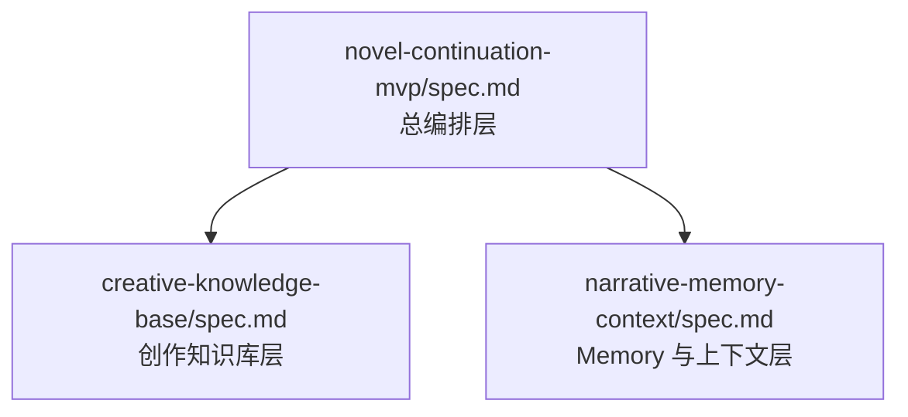
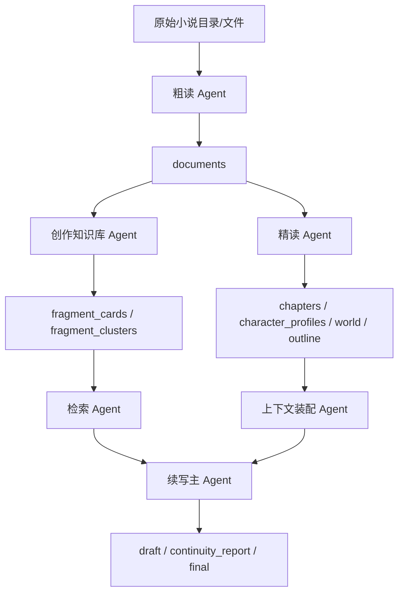

# 小说续写 MVP 实现设计稿

## Agent Reading Guide

先读 [`AGENT_CONTEXT.md`](AGENT_CONTEXT.md) 判断是否需要展开本文。本文只维护
主编排层设计，不承载 Memory / KB / Writer 字段级细节。

- 主数据流和 orchestration：读第 4 节。
- 粗读 Agent / 续写主 Agent 职责：读第 3 节。
- 跨层装配：读第 4.3 节，并回查 [`contracts.md`](contracts.md)。
- 旧 MVP / one-shot 兼容边界：读第 5 节。

## 1. 目标
本设计稿只负责解释三层 spec 的关系、核心 Agent 的职责边界、主数据流和跨层装配方式。已经下沉到创作知识库层与 Memory 层的字段级设计、表结构与 prompt contract，不再在本文件重复维护。

## 当前状态

- 本文上半部分描述当前主编排层已经落地的主路径与装配方式。
- 文末保留兼容与边界说明，用于解释旧 MVP 路径、过渡期产物和命名约定。
- 创作知识库层与 Memory 层的字段级实现细节，仍以下游子层文档为准。

## 2. 三层结构

### 2.1 分层关系

### 2.2 各层关注点

| 层级 | 主要回答的问题 | 主要产物 | 典型 Agent |
| --- | --- | --- | --- |
| 总编排层 | 系统如何串起来运行 | `documents`、主流程状态、runs | 粗读 Agent、续写主 Agent、主调度器 |
| 创作知识库层 | 该参考作者以前怎么写 | `fragment_cards`、`fragment_clusters`、rerank 结果 | 创作知识库 Agent、检索 Agent |
| Memory 与上下文层 | 当前世界与人物状态是什么 | 人物档案、世界观、章节摘要、大纲、上下文包 | 精读 Agent、Memory 更新 Agent、上下文装配 Agent |

### 2.3 子层文档引用

- 创作知识库实现细节：[`../creative-knowledge-base/spec.md`](../creative-knowledge-base/spec.md) / [`../creative-knowledge-base/design.md`](../creative-knowledge-base/design.md)
- Memory 与上下文实现细节：[`../narrative-memory-context/spec.md`](../narrative-memory-context/spec.md) / [`../narrative-memory-context/design.md`](../narrative-memory-context/design.md)

## 3. 主层角色归属

### 3.1 粗读 Agent

结论：**粗读 Agent 仍归属于总编排层**。

原因：

- 它是整个系统的入口型 Agent，负责把原始小说文件转成统一的 `documents`
- 它同时服务于创作知识库层和 Memory 层
- 它不直接拥有桥段卡片、人物档案、世界观或 rerank 逻辑

因此它的定位是：

- 归属于总编排层
- 服务于两个子层
- 不被任何单个子层独占

### 3.2 续写主 Agent

结论：**续写主 Agent 的总装配职责仍归属于总编排层**。

当前已明确：

- Creative KB 只负责桥段检索与参考片段筛选
- Memory 层只负责事实型上下文装配
- 主层负责把 `scene_brief`、`reference_fragments`、`context_payload` 组装为 `WriterInputBundle`

## 4. 当前主路径（已落地）

### 4.1 主数据流

### 4.2 总编排层职责

#### 粗读 Agent

- 输入：原始小说目录或文件
- 输出：`documents`
- 负责：
  - 目录分析
  - 读取策略判断
  - 原文切分
  - `documents` 入库
  - 轻量标签初筛
  - 粗读进度维护
- 不负责：
  - `fragment_card` 构建
  - 人物档案更新
  - 世界观维护
  - rerank

#### 续写主 Agent

- 输入：
  - 锚点上下文
  - 最近窗口
  - 创作知识库层返回的桥段候选
  - Memory 层返回的事实型上下文包
- 输出：
  - `draft`
  - `continuity_report`
  - `final`
  - `runs/*`
- 负责：
  - 主流程编排
  - ScenePlan / SceneBrief 入口协同
  - 调用桥段检索
  - 调用事实型上下文装配
  - 正文续写
  - 一致性检查
  - 产物保存

### 4.3 跨层装配 Contract

#### 总编排层 -> 创作知识库层

最小输入：

- `documents`
- `anchor_context`
- `recent_window_summary`
- `goal`
- `previous_generated_segment`（可选）
- 基础检索上下文：
  - `character_hits`
  - `timeline_hits`
  - `lore_hits`

#### 总编排层 -> Memory 层

最小输入：

- `book_id`
- `documents`
- 当前章节位置 / `document_title_index`
- 预算信息
- 相关角色提示（可选）

#### 子层 -> 续写主 Agent

创作知识库层输出：

- `scene_brief` 或兼容旧 `ScenePlan` 的检索意图
- 粗筛候选
- rerank 结果
- 最终参考片段集合

Memory 层输出：

- `chapter_context`
- `world_summary_md`
- `character_profiles`
- `story_outline_md`
- `missing_context`

主层当前装配结果：

- `WriterInputBundle`
  - `scene_brief` 来自创作知识库层
  - `reference_fragments` 来自 `rerank_result.selected_fragment_ids` 的展开结果
  - `context_payload` 来自 Memory 层的 `ContextAssemblyPayload`

### 4.4 运行顺序

#### 离线阶段

1. 粗读 Agent 构建 `documents`
2. 创作知识库层基于 `documents` 构建桥段知识库
3. Memory 层基于 `documents` 做精读并维护长期上下文

#### 在线续写阶段

1. 读取锚点上下文和最近窗口
2. 生成 `SceneBrief` 或兼容使用旧 `ScenePlan`
3. 调用创作知识库层完成桥段检索
4. 调用 Memory 层装配事实型上下文
5. 主层组装 `WriterInputBundle`
6. 续写主 Agent 生成草稿
7. 执行一致性检查并保存产物

### 4.5 当前 runs 落盘约定

当前主层在在线续写路径中，建议重点落盘以下中间产物：

- `retrieval_bundle.json`
  - Creative KB 在线检索输出
- `scene_brief.json`
  - 创作知识库层返回的检索意图对象
- `writer_input_bundle.json`
  - 主层对 `scene_brief + reference_fragments + context_payload` 的装配结果

说明：

- `writer_input_bundle.json` 用于体现主层已经把创作知识库层与 Memory 层结果合流
- `scene_plan.json` 仍可作为兼容旧路径或过渡期产物继续保留
- `coarse_result` 仍然只建议在调试 / QA 模式下包含在 `retrieval_bundle.json` 中

## 5. 兼容与保留说明

### 5.1 为什么这样拆

- 更适合人工阅读检查 spec
- 更适合把粗读、桥段检索、精读 / Memory、续写编排拆成独立 Agent 并行执行
- 各层数据责任更清晰
- 失败恢复更容易定位
- 主层不会继续膨胀成“所有字段和所有 prompt 都放一处”的文档

### 5.2 当前规范

- `novel-continuation-mvp/spec.md` 只保留总编排层要求
- 新增能力优先判断属于：
  - 创作知识库层
  - 或 Memory 与上下文层
- 具体字段、表结构、prompt contract 优先进入对应子层的 `spec.md` / `design.md`
- 不修改 `src/smolagents/*` 核心抽象
- `novel_agent/` 作为边车模块承载全部新增实现

### 5.3 兼容保留项

- 旧 `ScenePlan` 仍可作为过渡期输入继续保留，但主路径检索意图已收敛到 `SceneBrief`
- 旧 MVP 直连路径仍可作为回归基线保留，但主路径总装配已迁移到 `MainLayerOrchestrator`
- `scene_plan.json` 仍可作为兼容产物保留，但主层当前的核心装配产物已变为 `writer_input_bundle.json`
- 基础检索工具仍保留，但主检索路径已经迁移到 Creative KB 层

### 5.4 命名约定

- `book_id`: 一本小说的稳定标识
- `doc_id`: `documents` 表主键，对应一个粗读后的 document
- `document_title_index`: 章节逻辑 ID
- `agent_stage`: 处理阶段，推荐取值 `segmentation`、`close_reading`
