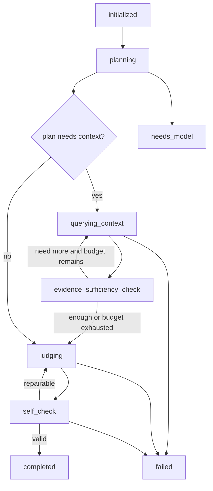

# Reviewer Agent 独立评审模块设计

## 1. Design Summary

Reviewer Agent 是一个模型驱动、只读、可插拔的评审运行时。

它把“评审能力”从 Writer 和 benchmark 中抽象出来，但第一阶段不改动既有 Writer / benchmark 流程。Reviewer Runtime 接收 `ReviewRequest`，解析 `ReviewTarget`，驱动指定 Reviewer 通过模型多轮查询 Memory / KB，最后输出 `ReviewReport`。

```text
ReviewRequest
  -> ReviewTargetResolver
  -> ReviewerRuntime
  -> Reviewer Agent Loop
       -> model planning
       -> ReviewerMemoryTool / ReviewerKBTool / ReviewerArtifactTool
       -> model judging
       -> model self-check
  -> ReviewReport
```

## 2. Runtime Components

### 2.1 ReviewTargetResolver

职责：

- 将 `ReviewTarget` 解析成 `resolved_text`。
- 保留来源引用，例如 document id、artifact path、chapter id、range hint。
- 校验目标类型是否被指定 Reviewer 支持。
- 对超长文本做输入裁剪，但必须记录裁剪策略。

Resolver 不做语义评审，不判断文本质量。

### 2.2 BaseReviewer

Reviewer 插件只声明能力和 prompt 结构，不直接管理运行时循环。

推荐接口：

```python
class BaseReviewer(Protocol):
    reviewer_id: str
    reviewer_version: str
    supported_target_types: set[str]
    dimensions: list[str]

    def build_planning_prompt(self, request: ReviewRequest, resolved_target: ResolvedReviewTarget) -> ModelPrompt: ...
    def build_judging_prompt(self, state: ReviewerLoopState) -> ModelPrompt: ...
    def build_self_check_prompt(self, report: ReviewReport, state: ReviewerLoopState) -> ModelPrompt: ...
```

Reviewer 插件不得直接访问数据库、文件系统或 KB 存储。所有外部资料必须通过 runtime tool 注入。

### 2.3 ReviewerRuntime

职责：

- 校验 `ReviewRequest`。
- 调用 `ReviewTargetResolver`。
- 运行 Agent Loop。
- 执行模型请求的工具调用。
- 管理预算、重试、trace 和状态。
- 校验最终 `ReviewReport`。
- 将报告和原始模型响应落盘。

Runtime 不内置文学规则或角色规则。

### 2.4 ReviewerRegistry

职责：

- 注册正式 Reviewer。
- 按 `reviewer_id` 和 `target_type` 选择 Reviewer。
- 拒绝 fake / baseline reviewer 进入正式 registry。
- 暴露可用 Reviewer manifest。

### 2.5 ReviewerSuite

职责：

- 对同一 `ReviewTarget` 运行多个 Reviewer。
- 聚合分数、summary 和 findings。
- 保留每个 reviewer 的独立报告。
- 只做聚合，不覆盖单个 reviewer 的判断。

第一阶段 suite 可以串行运行；后续可并发运行。

## 3. Agent Loop Design

### 3.1 State Machine



### 3.2 Planning

模型输入：

- `ReviewTarget` metadata。
- 解析后的目标文本。
- `ReviewContextPolicy`。
- Reviewer 的 rubric。
- 预算限制。

模型输出 `ReviewPlan`：

- 评审维度。
- 初步风险点。
- 是否需要 Memory / KB / artifact 证据。
- 工具调用请求。
- 预期证据类型。

Planning 失败或模型不可用时，runtime 返回 `needs_model` 或 `failed`。

### 3.3 Context Query

模型可以请求：

- `memory_query`
- `kb_retrieval`
- `artifact_read`

Runtime 执行工具调用，并把结果追加到 loop state。

工具调用必须受 `ReviewContextPolicy` 和 `ReviewBudget` 限制。任何未授权的查询必须被拒绝，并记录在 trace 中。

### 3.4 Evidence Sufficiency

模型判断当前证据是否足够：

- `sufficient`
- `needs_more_context`
- `blocked_by_missing_context`
- `budget_exhausted_proceed`

若 `blocked_by_missing_context` 且该维度不能可靠评审，最终 report 应降低 confidence 或返回 `skipped` / `failed`，不得用猜测补足。

### 3.5 Judging

模型基于目标文本和授权证据输出 `ReviewReport`。

Judging prompt 必须要求：

- 输出中文总评。
- 给出 0-100 分。
- 每个主要问题提供证据引用。
- 明确区分“文本中存在的问题”和“证据不足无法判断的问题”。
- 不把 Memory / KB 中的事实误写成目标文本事实。

### 3.6 Self Check

Self-check 由模型完成，用于确认：

- 报告是否符合 schema。
- 分数和 findings 是否一致。
- 每条强断言是否有目标文本或上下文证据。
- 是否使用了未授权 reference truth。
- 是否把建议当成事实。

Self-check 不改变核心语义；若只存在 JSON 结构问题，可触发一次语法修复。若存在语义矛盾，应返回 `failed` 或重新进入 judging，受 retry budget 限制。

## 4. Memory Query Integration

Reviewer 通过 `ReviewerMemoryTool` 使用 `NarrativeMemoryQueryService`。

Memory Query 已经定义为输入来源无关，可以由 user feedback、reviewer feedback 或 retry instruction 触发。Reviewer 应复用同一套协议，而不是建立新的私有检索路径。

推荐工具接口：

```python
class ReviewerMemoryTool:
    def query(
        self,
        *,
        conn: sqlite3.Connection,
        book_id: str,
        intent: str,
        budget: MemoryQueryBudget,
        source: str = "reviewer_agent",
    ) -> MemoryEvidenceBundle: ...
```

内部流程：

1. 调用 `NarrativeMemoryQueryService.root_scan()`。
2. 将 candidates 交回 Reviewer 模型选择。
3. 调用 `drill_down()`。
4. 直到模型停止、预算耗尽或 resolve 到 event/chapter/document evidence。
5. 返回 `MemoryEvidenceBundle` 和完整 trace。

Reviewer Runtime 不得直接扫描 Memory DB 或 `.memory` Markdown。

## 5. KB Integration

Reviewer 通过 `ReviewerKBTool` 读取 Creative KB。

推荐工具接口：

```python
class ReviewerKBTool:
    def retrieve(
        self,
        *,
        book_id: str,
        intent: str,
        target_excerpt: str,
        budget: ReviewToolBudget,
    ) -> KBEvidenceBundle: ...
```

KB 查询可用于：

- 风格和氛围对照。
- 桥段执行质量参考。
- 结构模式一致性。
- 相似场景密度或节奏参考。

KB 工具只读，不写回，不更新权重，不修改 rerank 逻辑。

## 6. Context Policy And Leakage

Reviewer 有更高评审视角，但必须受场景约束。

### writer_assist

- 可读当前目标、prefix-authorized Memory、KB、当前 Writer artifacts。
- 不可读 benchmark held-out reference truth。
- 报告只作为用户反馈参考。

### user_review

- 可读用户授权的目标和上下文。
- 是否可读 Memory / KB 由 UI 或调用方显式指定。
- 不自动推进 Writer 流程。

### benchmark

- 可读 sample 明确授权的 reference truth。
- 必须在 report 中记录 reference truth 使用。
- 不得把 reference truth 反馈回 Writer。
- Reviewer 分数和意见只作为 benchmark 参考观察项，不直接作为 benchmark 通过标准。

### diagnostic

- 用于开发调试。
- 必须保留所有工具 trace。
- 若使用 fake / dry-run，必须在 report 中标记。

## 7. Reviewer Types

### 7.1 OutlinePlotDevelopmentReviewer

`reviewer_id`: `outline_plot_development`

支持目标：

- `outline`

关注：

- Writer 生成的大纲是否承接之前的剧情大纲。
- 剧情发展方向是否合理。
- 阶段推进是否有因果链。
- 主线、支线和人物线是否有可执行落点。
- 是否存在跳过关键转折、强行推进或长期结构失衡。

上下文策略：

- SHOULD 读取之前的剧情大纲或篇章地图。
- MAY 查询 Memory 中相关历史事件。
- 不关注正文文笔。

### 7.2 ChapterSynopsisPlotCharacterReviewer

`reviewer_id`: `chapter_synopsis_plot_character`

支持目标：

- `synopsis`
- `chapter_brief`

关注：

- Writer 生成的章节梗概是否承接之前的剧情大纲。
- 本章剧情目标、事件推进和人物动机是否合理。
- 梗概涉及的人物行动、语言倾向、关系状态是否与人物档案冲突。
- 是否存在人物能力、身份、阵营或情感状态的无依据跃迁。
- 梗概是否足以指导正文写作。

上下文策略：

- MUST 支持多轮 Memory Query。
- 模型先从梗概中抽取人物、行动、关系、状态变化和关键事件。
- Runtime 将模型查询意图交给 `ReviewerMemoryTool`。
- 模型基于查询结果判断证据是否足够；不足时可继续查询，直到预算耗尽。
- 若证据不足，报告必须明确标记“证据不足”，不得臆造人物档案。

### 7.3 LocalDraftContinuityReviewer

`reviewer_id`: `local_draft_continuity`

支持目标：

- `draft`

关注：

- 最新正文草稿和最近几段正文之间是否连续。
- 是否出现明显剧情错误。
- 是否出现剧情发展中断、场景衔接断裂或视角突然跳变。
- 文风切换是否过于生硬。
- 草稿局部节奏是否突然变松、变硬或脱离上一段叙事惯性。

上下文策略：

- SHOULD 读取最近几段正文和最新草稿。
- 默认不读取全文大纲，不做全局剧情方向裁决。
- MAY 不查询 Memory；若调用方允许，也只能查询与局部衔接直接相关的 evidence。

### 7.4 MemoryDraftConsistencyReviewer

`reviewer_id`: `memory_draft_consistency`

支持目标：

- `draft`

关注：

- 草稿中提及的事件、人物、地点、关系、设定和状态。
- 这些内容是否与历史正文、人物档案、世界观记录或上一次续写产物矛盾。
- 是否存在人物知道不该知道的信息、状态回滚、关系跳变、时间线冲突。
- 是否遗漏前文已经建立的关键限制。

上下文策略：

- MUST 支持多轮 Memory Query。
- 模型先抽取待核查 claims，再按 claim 生成 Memory Query intent。
- Runtime 必须记录 `MemoryQueryState` 和 `MemoryEvidenceBundle` trace。
- 重点是历史相关性，不评价整体文笔或全文大纲合理性。
- 必须严格区分“确认矛盾”和“证据不足”。

### 7.5 KBDraftStyleAtmosphereReviewer

`reviewer_id`: `kb_draft_style_atmosphere`

支持目标：

- `draft`
- `raw_text`

关注：

- 当前正文草稿的场景类型、叙事功能、情绪基调和文体特征。
- KB 中相似剧情或相似场景段落的文笔细节。
- 草稿与原作在句式密度、动作描写、心理描写、氛围推进和节奏上的一致性。
- 是否出现模板化、现代化突兀表达或氛围断裂。

上下文策略：

- 模型先总结目标草稿的剧情和场景特征。
- Runtime 使用这些特征调用 `ReviewerKBTool` 查询相似桥段或场景。
- 模型只比较文笔、文风、氛围和细节执行，不把 KB 相似段落当作剧情正确性标准。
- 通常不需要 Memory Query。

### 7.6 Shared Output Rule

上述所有 Reviewer 都必须输出中文参考意见和 0-100 参考评分。评分字段只表示该 Reviewer 视角下的质量估计，不作为 Writer 或 Benchmark 的通过标准。

## 8. Reviewer Smoke Test Design

Reviewer smoke 的目标是验证五类 Reviewer 在真实模型、真实 Memory Query 和真实 KB 检索条件下，能够对偏离写作意图或存在明显错误的构造输入提出中文修改意见。

Smoke 不验证 Writer 是否生成了好文本，也不把 Reviewer 分数作为通过标准。Smoke 只验证 Reviewer 能否：

- 成功运行模型驱动 Agent Loop。
- 根据需要触发真实 Memory Query 或 KB Retrieval。
- 对构造文本中的明显问题提出中文审核意见。
- 产出 `score_usage = reference_only` 的参考评分。
- 保留 request、resolved target、tool trace、model responses 和 report。

### 8.1 Shared Real Modeling Task

五个 Reviewer smoke case MUST 共用一个真实建模任务，不得为五类 Reviewer 分别读取五本书或创建五个建模任务。

共享建模任务流程：

```text
one real source text
  -> document import / segmentation
  -> real rough read model calls
  -> real close read model calls
  -> real Narrative Memory artifacts and pages
  -> real Creative KB build
  -> reviewer smoke case builder
  -> five constructed ReviewTargets
  -> five real Reviewer runs
```

约束：

- 粗读、精读、Memory 生成、Memory Query、KB 构建和 Reviewer 都必须是真实模型 prompt 请求。
- Memory / KB 不得使用 synthetic DB、fake markdown、规则式 fallback 或手写历史事实。
- 只有 Reviewer 的 `ReviewTarget.text` 可以是构造数据。
- 构造数据必须标记 `constructed_for_smoke = true`，不得写回 Memory / KB。
- 构造数据应从真实 Memory / KB 中动态选取人物、事件、场景或风格证据后生成，不得在代码、prompt fixture 或测试默认数据中写死某一部小说的专有名词、角色名或设定名。

### 8.2 Smoke Case Builder

Smoke runner SHOULD 使用一个 `ReviewerSmokeCaseBuilder` 生成五个 case。

Case builder 的职责：

- 读取共享建模任务输出的 Memory / KB index。
- 通过真实 Memory Query 选择少量可引用的历史事件、人物状态、章节梗概或场景特征。
- 构造带有明确缺陷的 `ReviewTarget.text`。
- 写入每个 case 的预期问题类型，但不写入 Reviewer 应输出的固定答案。

Case builder 可以使用真实模型生成构造文本，也可以使用通用模板拼装，但不得硬编码具体小说角色、设定、桥段映射或语义规则。构造文本只用于 smoke，不代表 Writer 产物。

推荐 artifact：

```text
runs/reviewer_smoke/<run_id>/
  modeling/
    source_manifest.json
    rough_read_summary.json
    close_read_summary.json
    memory_manifest.json
    kb_manifest.json
  cases/
    outline_plot_development/
      smoke_case.json
      review_request.json
      resolved_target.json
      report.json
      loop_trace.json
    chapter_synopsis_plot_character/
    local_draft_continuity/
    memory_draft_consistency/
    kb_draft_style_atmosphere/
  summary.json
```

### 8.3 Case A: Outline Plot Development

Reviewer:

- `outline_plot_development`

Shared context:

- 之前的剧情大纲、篇章地图或 Memory 中的事件线索。

Constructed target:

- 一个虚假的 event list / 大纲。
- 该大纲应有明显剧情发展问题，例如阶段推进跳跃、核心目标突然偏离、因果链缺失、主线和支线断裂。
- 构造内容应基于真实 Memory 中动态抽取的事件或人物标签，不硬编码专名。

Expected smoke evidence:

- Reviewer 成功读取目标大纲和授权历史大纲 / Memory evidence。
- Report 至少包含一个 `major` 或 `critical` finding，说明剧情发展或结构推进问题。
- `suggestion_zh` 或 `suggested_revision_focus` 非空。
- `score_usage = reference_only`。

### 8.4 Case B: Chapter Synopsis Plot And Character

Reviewer:

- `chapter_synopsis_plot_character`

Shared context:

- 之前的剧情大纲。
- 相关人物档案、人物关系、历史行动或状态记录。

Constructed target:

- 一个虚假的章节梗概或 `chapter_brief`。
- 该梗概应包含剧情合理性问题，以及至少一个人物设定或关系状态冲突，例如无铺垫的阵营切换、能力越界、关系跃迁或动机断裂。

Expected smoke evidence:

- Reviewer 触发真实 `ReviewerMemoryTool`。
- `memory_query_trace` 非空，并能看到多轮查询或至少一次模型驱动 candidate selection。
- Report 区分剧情问题和人物一致性问题。
- Findings 引用 Memory evidence 或明确标记证据不足。
- `score_usage = reference_only`。

### 8.5 Case C: Local Draft Continuity

Reviewer:

- `local_draft_continuity`

Shared context:

- 最近几段真实正文或从真实文档中截取的最近上下文。

Constructed target:

- 一个虚假的最新正文草稿。
- 草稿应包含局部承接问题，例如上一段场景未结束就突然切到新场景、叙事视角突变、剧情动作断裂、情绪和文风切换过硬。

Expected smoke evidence:

- Reviewer 重点引用最近上下文和最新草稿。
- 默认不需要 Memory Query；若发生查询，也必须只服务局部衔接判断。
- Report 不应把全文大纲合理性作为主要问题。
- Findings 至少指出一个局部连续性或文风突变问题。
- `score_usage = reference_only`。

### 8.6 Case D: Memory Draft Consistency

Reviewer:

- `memory_draft_consistency`

Shared context:

- 真实 Narrative Memory。
- 可选：上一次续写产物或最近历史正文。

Constructed target:

- 一个虚假的正文草稿。
- 草稿应提及从 Memory 中动态抽取的人物、事件、关系、地点或设定，并故意引入历史矛盾，例如状态回滚、人物知道不该知道的信息、关系反转、时间线错误或世界规则冲突。

Expected smoke evidence:

- Reviewer 先抽取待核查 claims。
- Reviewer 通过 `ReviewerMemoryTool` 发起真实多轮 Memory Query。
- Report 的 evidence refs 包含 Memory evidence。
- Report 明确判断确认矛盾或证据不足，不得凭空补事实。
- `score_usage = reference_only`。

### 8.7 Case E: KB Draft Style And Atmosphere

Reviewer:

- `kb_draft_style_atmosphere`

Shared context:

- 真实 Creative KB。
- KB 中与目标草稿剧情或场景特征相似的段落、桥段或风格参考。

Constructed target:

- 一个虚假的正文草稿。
- 草稿剧情可以简单，但文笔、风格或氛围应明显偏离原作，例如过度说明、现代化表达突兀、动作/心理描写密度不匹配、氛围推进断裂。

Expected smoke evidence:

- Reviewer 先用模型总结草稿的剧情和场景特征。
- Runtime 使用这些特征触发真实 `ReviewerKBTool`。
- `kb_query_trace` 非空。
- Report 主要评价文笔、文风、氛围和细节执行，不把 KB 相似段落当作剧情正确性标准。
- `score_usage = reference_only`。

### 8.8 Smoke Summary Criteria

Reviewer smoke run 成功标准：

- 五个 case 均调用真实 Reviewer 模型。
- 需要 Memory 的 case 有真实 `memory_query_trace`。
- 需要 KB 的 case 有真实 `kb_query_trace`。
- 每个成功 report 都包含中文 `summary_zh`、参考 `score`、`score_usage = reference_only`、非空 `findings` 或 `suggested_revision_focus`。
- 每个 case 的 artifacts 可复现，包括构造输入、上下文 policy、模型响应、tool trace 和 report。
- 如果某个 case 因模型不可用或 JSON 解析失败而失败，必须返回 `failed` / `needs_model`，不得生成伪成功评分。

## 9. Report Persistence

Reviewer report SHOULD 落盘到调用方指定目录。

推荐结构：

```text
reviewer/
  review_request.json
  resolved_target.json
  loop_trace.json
  model_responses/
    planning.json
    judging.json
    self_check.json
  reports/
    local_draft_continuity.review.json
    memory_draft_consistency.review.json
    suite.review.json
```

报告路径不作为用户主状态展示，但可用于 debug drawer、benchmark summary 和开发验收。

## 10. Migration Strategy

第一阶段不迁移旧 Reviewer。

后续迁移顺序建议：

1. 将 `SmokeReviewerService` 的 prompt 迁移为 `local_draft_continuity` 或 `memory_draft_consistency` 的 benchmark profile。
2. 将 `OutlineResearchReviewer` 迁移为 `outline_plot_development` 或 `chapter_synopsis_plot_character` 的 benchmark reference policy。
3. 将 Creative KB reviewer 保持为 KB benchmark reviewer，必要时适配 `ReviewerReport` contract。
4. Writer 流程只读取 Reviewer report 作为辅助材料，不直接让 Reviewer 改写 Writer 状态机。

## 11. Implementation Notes

- Reviewer 相关代码建议放在 `novel_agent/app/reviewer/`。
- schema 可放在 `novel_agent/app/schemas/reviewer_schema.py`。
- prompts 可放在 `novel_agent/app/prompts/reviewer/`。
- tests 应覆盖模型失败、JSON 失败、未授权 reference truth、Memory Query trace、不同 target type。
- 正式 Reviewer tests 可以使用 fake model client，但 fake model 只能模拟模型输出，不得把本地规则注册成 reviewer。
