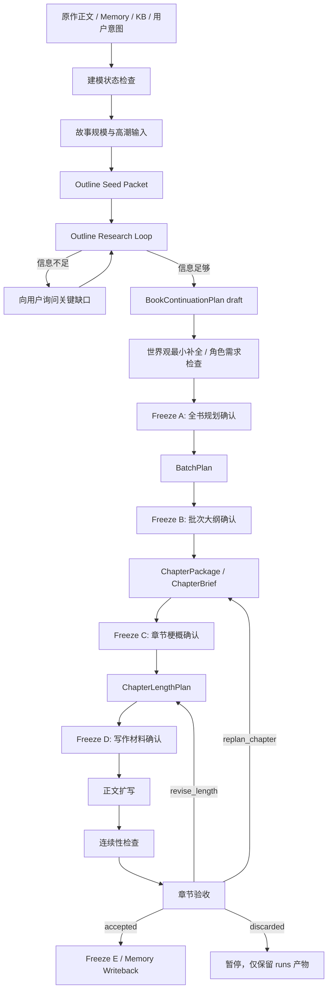

# Writer Agent 分层生成设计

## 1. 文档结构

Writer 设计文档收敛为两个核心文件：

- [`design.md`](design.md)：描述 Writer 的主流程、层级职责、冻结点、回滚边界和正文执行边界。
- [`designs/outline-research-loop.design.md`](designs/outline-research-loop.design.md)：描述大纲生成前的多轮 research、query 解析、本地检索与信息充足性判断。

字段级约束、恢复规则和验收 contract 仍以这些 spec / contract 为准：

- [`spec.md`](spec.md)
- [`specs/writer-input.spec.md`](specs/writer-input.spec.md)
- [`specs/workflow-and-recovery.spec.md`](specs/workflow-and-recovery.spec.md)
- [`specs/review-and-writeback.spec.md`](specs/review-and-writeback.spec.md)
- [`contracts.md`](contracts.md)

历史上独立的 workflow、writer execution、review writeback design 已压缩进本文摘要。它们不再作为新的设计入口维护，避免 class / method 级历史细节和当前代码脱节。

## 2. 设计结论

Writer 的核心不是让一个万能 Agent 从用户一句话直接写正文，而是建立一条可审阅、可回滚、可恢复的长篇生成流水线：

```text
建模基线
  -> 用户续写意图 / 故事规模 / 高潮约束
  -> 大纲研究循环 Outline Research Loop
  -> 全书续写规划 Freeze A
  -> 批次剧情规划 Freeze B
  -> 章节标题与高密度梗概 Freeze C
  -> 章节长度与写作输入 Freeze D
  -> 正文扩写
  -> 校验 / 验收 / 写回 Freeze E
```

本设计采用两个原则：

- **大纲层最重要**：全书大纲、批次大纲和章节梗概要承载人物、场景、行动、结果、关系推进、伏笔铺设和禁止提前消费项。
- **正文层最简单**：正文 Writer 应接近“受约束渲染器”，主要负责文笔、节奏、场景呈现和风格，不负责重新决定剧情走向。

## 3. 核心流程



## 4. 大纲研究循环

大纲生成不应由编排器一次性把所有 Memory 拼进 prompt。正确做法是先给模型轻量索引，让模型主动提出自己需要了解的故事细节、人物档案或世界观概念，再由本地 Agent 翻译成 SQLite / Markdown / Memory 查询。

初始输入称为 `OutlineSeedPacket`，只提供索引入口：

- 用户续写意图、故事规模、节奏偏好和高潮约束
- 全部人物姓名、别名和极短标签
- 世界观精炼梗概
- 世界观重要概念名词索引
- 已有故事精炼总览：每部小说的大致内容、起止时间和当前续写起点
- 可选的未决伏笔、悬念或源作品结构位置标题级索引

模型可在多轮中返回三类核心请求：

- `story_detail`：用一句自然语言说明想进一步了解的故事细节。
- `character_profile`：按人名请求人物当前状态、能力边界、关系状态和最近变化。
- `world_concept`：按概念名词请求规则、限制、代价、例外和禁止突破点。

本地 `Context Broker` 负责把这些语义请求转换为可执行检索，并返回裁剪后的 evidence。模型每轮判断信息是否足够；若不足以靠本地资料解决，则向用户提出少量关键问题。

详细请求格式、`Story Detail Resolver`、事件索引要求和 research budget 见 [`designs/outline-research-loop.design.md`](designs/outline-research-loop.design.md)。

## 5. 层级职责

### Layer 0: 建模基线

消费原作正文、粗读 / 精读结果、人物档案、世界观、章节摘要、历史大纲、源作品篇章地图和 Creative KB 结构模式。

本层只判断是否具备继续生成的最低条件，不写新剧情。

### Layer 0A: 用户意图、规模与高潮输入

在生成全书大纲前收集：

- 续写方向
- 目标章节数和目标总字数
- 默认单章字数
- 节奏 profile
- 冲突高潮、情绪高潮和目标章节位置
- 必须铺垫、不得提前解决的事项

这些输入进入 `BookContinuationPlan`，不能只作为 prompt 备注。

### Layer 1: 全书续写规划

基于 Outline Research Loop 的结果生成 `BookContinuationPlan`、`ArcRoadmap` 和 `chapter_outline_slots`。

本层决定长程方向、阶段性高潮、主要人物弧线、关系推进上限、终局约束和禁止提前消费项。它必须标注确认事实、推断补全、用户授权设定和未决问题。

### Layer 1B / 1C: 世界观与人物补充

世界观补全只补后续剧情真的需要的规则、组织、能力限制、地理与历史边界。

人物补充先解析用户显式点名但 Memory 不存在的人物，再检查剧情结构中尚未被具体人物承接的功能位。计划人物以 `PlannedCharacterProfile` 存在，只有正文中首次登场、通过校验并完成回写后，才转入正式 Character Memory。

### Layer 2: 批次剧情规划

`BatchPlan` 是全书大纲和章节梗概之间的中间层。它限定当前批次的入口、目标、冲突、中点、出口钩子、必须回收和不得提前消费的内容。

批次层是最适合用户修改的“大纲层”：比全书规划具体，比章节梗概抽象，影响面清楚。

### Layer 3: 章节标题与高密度梗概

`ChapterPackage` / `ChapterBrief` 应尽量给出完整执行约束：

- 章节目标、情绪目标、冲突目标
- 场景 / 段落级 `scene_beats`
- 登场人物、地点、行动和结果
- 关系当前状态与允许推进幅度
- 铺垫、回收、转场、结尾 hook
- 必须出现与禁止出现事项
- 来源和 evidence trail

这一层越完整，正文层越稳定。

### Layer 4: 正文扩写

正文 Writer 只消费冻结后的 `ChapterBrief`、长度预算、事实约束、风格参考、禁止项和关系门禁。

正文层不负责：

- 重写全书方向
- 新增关键设定
- 自由创建关键新角色
- 私自推进关系跃迁
- 越过当前批次提前消费伏笔

### Layer 5: 校验、验收与写回

章节草稿通过连续性检查后仍必须等待用户验收。只有 `GenerationReviewDecision.status = accepted` 才能进入 `Freeze E` 和正式 Memory writeback。

`revise_length` 回到长度计划，`replan_chapter` 回到章节梗概，`discarded` 仅保留运行产物并暂停。

## 6. 冻结点

| Freeze | 冻结内容 | 下游影响 |
| --- | --- | --- |
| `Freeze A` | `BookContinuationPlan`、世界观补全、人物补充方案 | 修改后全部批次、章节和正文失效 |
| `Freeze B` | 当前 `BatchPlan` | 修改后当前批次及后续批次下游产物失效 |
| `Freeze C` | 当前 `ChapterPackage` / `ChapterBrief` | 修改后相关章节长度计划、写作输入、正文和回写失效 |
| `Freeze D` | 单章写作材料、长度预算、事实和风格输入 | 修改后当前章正文失效 |
| `Freeze E` | 已验收终稿与状态变化 | 允许正式写回 Memory |

冻结点是工程边界，不是用户界面主文案。CLI / GUI 应展示“请审阅本批剧情大纲”“请确认本章写作材料”“请验收当前章节”等自然语言状态。

## 7. 受控修订与回滚

用户可以在审阅节点直接改 artifact，也可以用自然语言触发 `Scoped Artifact Revision`。修订完成后必须回到原审阅状态，展示 diff 并等待用户确认，不能自动越过 Freeze。

回滚原则：

- 上游 artifact 被修改时，下游依赖产物必须失效。
- 修改长度预算只影响当前章正文，不必自动作废后续章节。
- 修改章节梗概会影响该章及其后续章节。
- 修改批次大纲会影响当前批次及后续批次。
- 修改全书规划、世界观补全或人物补充方案会影响全部后续产物。
- 已进入 `canon_active` 的计划角色不能被静默覆盖，必须要求用户选择保留 canon、回滚首次登场章之后内容，或分叉替代方案。

## 8. Agent 划分

推荐保留以下逻辑角色，但不要求在代码中强制一一对应为 class：

- `Outline Research Agent`：根据轻量索引多轮提出 research request，维护 planning notebook，并判断信息是否足够。
- `Context Broker`：把语义请求转换为 SQLite / Markdown / Memory 查询，返回 evidence。
- `Book Planner`：生成全书续写规划和章节 slot。
- `World Expansion Agent`：补最小设定约束。
- `Character Casting Agent`：处理显式新角色和隐式角色缺位。
- `Batch Planner`：生成当前批次剧情大纲。
- `Chapter Package Planner`：生成章节标题、高密度梗概和 scene beats。
- `Chapter Length Planner`：生成默认长度和单章 override。
- `Writer Agent`：受限正文扩写器。
- `Review / Writeback Agent`：连续性检查、状态变化提取和 accepted-only 写回。
- `Workflow Controller`：推进状态、保存 artifact、处理暂停、恢复和回滚。

## 9. Contract 对齐

Writer 层新增对象不得重定义 MVP 跨层 contract：

- `ChapterBrief` 是 Writer 内部规划对象。
- `SceneBrief` 仍是创作知识库检索意图对象。
- `ContextAssemblyPayload` 仍是 Memory 层事实型上下文包。
- `WriterInputBundle` 仍是正文层跨层输入包。

`ChapterBrief -> SceneBrief` 应使用确定性派生规则，避免正文层和检索层各自理解一套目标。

## 10. 产物

主要运行产物包括：

- `outline_seed_packet.json`
- `outline_research_trace.json`
- `planning_notebook.json`
- `book_continuation_plan.json`
- `world_expansion_pack.json`
- `character_requirement_report.json`
- `character_cast_plan.json`
- `batch_plan.json`
- `chapter_package.json`
- `chapter_length_plan.json`
- `chapter_execution_input.json`
- `draft.md`
- `continuity_report.json`
- `generation_review_decision.json`
- `state_delta.json`
- `memory_writeback.json`

其中 research trace 和 planning notebook 用于解释大纲为什么这样设计；它们不是正式 Memory，也不得直接污染 canon。

## 11. 产品模式

- `Assist Mode`：默认在全书规划、批次规划、章节梗概、本章写作材料和写回前等待用户确认。
- `Batch Mode`：默认在全书规划、批次规划和章节梗概处等待用户确认，后续可批量执行。
- `Auto Novel Mode`：策略层可自动确认内部冻结点，但仍必须保存冻结记录、research trace 和回滚依赖。

## 12. 成功标准

- 大纲生成前模型能够主动查询故事细节、人物档案和世界观概念，而不是被动消费一次性 prompt。
- 大纲和梗概能承载足够高的信息密度，使正文层主要关注风格表达。
- 每个关键剧情安排都有来源、假设或用户授权记录。
- 章节草稿未被用户 accepted 时不会写回 Memory。
- 上游修改能稳定触发下游失效和局部重跑。
