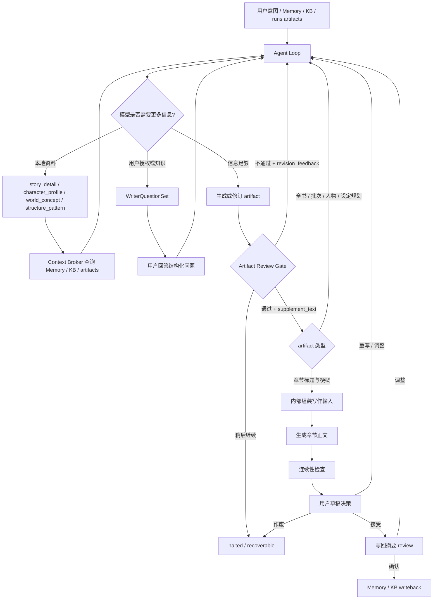

# Writer Agent 分层生成设计

## 1. 文档结构

Writer 设计文档收敛为两个核心文件：

- [`design.md`](design.md)：描述 Writer 的 Agent Loop、review gate、层级职责、回滚边界和正文执行边界。
- [`designs/outline-research-loop.design.md`](designs/outline-research-loop.design.md)：描述大纲生成前的多轮 research、query 解析、本地检索与信息充足性判断。

字段级约束、恢复规则和验收 contract 仍以这些 spec / contract 为准：

- [`spec.md`](spec.md)
- [`specs/runtime-boundaries.spec.md`](specs/runtime-boundaries.spec.md)
- [`contracts.md`](contracts.md)

历史上独立的 workflow、writer execution、review writeback design 已压缩进本文摘要。它们不再作为新的设计入口维护，避免 class / method 级历史细节和当前代码脱节。

## 2. 设计结论

Writer 的核心不是用流程编排器把用户推过一串固定确认点，而是建立一个模型主导的 Agent Loop：

```text
用户意图 / Memory / KB / runs artifacts
  -> Agent 判断需要查询、提问、生成或修订
  -> 模型通过 tool call 请求本地资料或用户补充
  -> Agent 生成或修订可审阅 artifact
  -> 用户通过并补充 prompt，或拒绝并给出修订反馈
  -> Agent 将反馈重新交给模型，直到 artifact 通过
  -> 正文生成、用户草稿决策、写回摘要审阅
```

本设计采用三个原则：

- **模型主导下一步**：当信息不足时，模型返回结构化 tool call；Agent 负责执行本地查询或用户交互，不用固定流程替模型猜测。
- **artifact 是协作界面**：全书规划、批次计划、章节梗概、章节草稿和写回摘要都是可审阅、可修改、可恢复的 artifact。
- **用户输入是 prompt 材料**：用户通过 artifact 时的补充信息会原文保留，并作为下一轮模型输入；用户拒绝 artifact 时的调整信息会驱动模型修订 artifact。

## 3. 核心流程



运行期主状态应尽量保持小而稳定：

- `agent_running`
- `reviewing_artifact`
- `needs_user_input`
- `generating_draft`
- `reviewing_draft`
- `writeback_review`
- `completed`
- `halted`
- `error`

内部 stage、artifact path、run id、workflow action 名只用于恢复、debug drawer、技术日志和结构化 action payload，不作为普通用户主状态展示。

## 4. 大纲研究循环

大纲生成不应由编排器一次性把所有 Memory 拼进 prompt。正确做法是先给模型轻量索引，让模型主动提出自己需要了解的故事细节、人物档案或世界观概念，再由本地 Agent 翻译成 SQLite / Markdown / Memory 查询。

初始输入称为 `OutlineSeedPacket`，只提供索引入口：

- 用户续写意图、故事规模、节奏偏好和高潮约束
- 从用户概述中抽取并对齐后的重点人物
- 可查询的人物姓名、别名和极短标签索引
- 世界观精炼梗概
- 世界观重要概念名词索引
- 已有故事精炼总览：每部小说的大致内容、起止时间和当前续写起点
- 可选的未决伏笔、悬念或源作品结构位置标题级索引

模型可在多轮中返回四类核心请求：

- `story_detail`：用一句自然语言说明想进一步了解的故事细节。
- `character_profile`：按人名请求人物当前状态、能力边界、关系状态和最近变化。
- `world_concept`：按概念名词请求规则、限制、代价、例外和禁止突破点。
- `structure_pattern`：请求与当前写作目标匹配的结构模式或篇章节奏参考。

本地 `Context Broker` 负责把这些语义请求转换为可执行检索，并返回裁剪后的 evidence。模型每轮判断信息是否足够；若不足以靠本地资料解决，则向用户提出少量关键问题。

Memory Query 属于 Writer Prompt Loop 的工具调用能力，而不是只在首次输入阶段运行。触发源可以是初次用户输入、用户对 artifact 的反馈、reviewer feedback 或生成失败后的 retry instruction。

当 research 达到 `ResearchBudget` 上限时，系统进入 `Sufficiency Gate`。预算耗尽后的出口只有三类：

- `needs_user_input`：存在阻塞缺口，需要用户补充知识或授权边界。
- `proceed_with_assumptions`：剩余缺口不阻塞大纲，可用明确假设继续生成草案。
- `blocked`：建模基础不足，必须先补 Memory / 历史大纲 / 续写起点等前置材料。

高风险事项，例如终局秘密、主要人物身份、关系跃迁、世界规则突破和新增人物是否成立，不得被模型静默假设。用户补充后的回答应作为 `user_authorized` evidence 进入 planning notebook，再继续一小轮 research 或直接生成大纲。

### Web / Chat UI 协作边界

Outline Research Loop 的用户补充问题可以通过聊天消息承载，但 Writer 层必须输出可绑定的结构化问题集，而不是要求 Web 从自然语言日志中猜测状态。

- 当 sufficiency gate 输出 `needs_user_input` 时，Writer workflow 应暴露 `WriterQuestionSet` 或等价 view payload，包含 `run_id`、`question_set_id`、`stage`、`questions[]`、关联缺口 / artifact 引用和继续 action。
- 问题集可以落盘为 `outline_research_question_set.json`，也可以嵌入 `sufficiency_decision.json`，但必须能被 Web / CLI / TUI 用同一语义恢复。
- Web 可以把问题显示成普通 Agent 消息，并把用户回答收集在同一个聊天输入框；但回答消息必须绑定 `question_set_id`，不能作为普通聊天自动推进 workflow。
- 继续执行必须通过 `continue_after_outline_research_input` 或等价结构化 action。payload 可同时包含自然语言 `answer_text` 和逐题 `user_answers[]`。
- 若只有 `answer_text`，Writer 层只做最小映射并保留原文；不得编造未回答问题，不得把普通聊天当作用户授权。
- 用户回答进入 planning notebook 时来源类型为 `user_authorized`，随后 workflow 决定继续一小轮 research、进入 `proceed_with_assumptions`，或生成规划产物。

详细请求格式、`Story Detail Resolver`、事件索引要求和 research budget 见 [`designs/outline-research-loop.design.md`](designs/outline-research-loop.design.md)。

## 5. Artifact Review Gate

Artifact review gate 是用户和 Agent 协作的主要边界。每个 gate 都展示当前 artifact 的用户可读摘要和可编辑视图，并提供三类动作：

- **通过并继续**：用户可填写 `supplement_text`。该文本原文落盘，作为后续模型 prompt 输入之一。
- **不通过并调整**：用户填写 `revision_feedback`。Agent 将反馈、当前 artifact、上游约束和必要 evidence 发给模型，要求输出修订后的 artifact。
- **稍后继续**：workflow 暂停，保留可恢复状态和 artifact 版本引用。

review gate 的记录至少包含：

- `review_id`
- `run_id`
- `artifact_kind`
- `artifact_id` 或 `artifact_path`
- `artifact_version`
- `decision`
- `supplement_text`
- `revision_feedback`
- `source_message_id`
- `reviewer_type`
- `created_at`
- `next_action`

普通 UI 应提供下一步提示，但不把内部技术名当作主文案。例如章节梗概 review 时提示用户审阅标题、梗概、人物动机、关系推进、场景顺序和伏笔安排；通过时可补充字数、风格、节奏、重点描写和禁止项；不通过时说明要调整哪里。

## 6. 章节正文生成

章节标题与梗概通过后，Agent 直接进入正文准备与生成：

- 加载已通过的 `ChapterPackage` / `ChapterBrief`
- 合并用户在通过动作里输入的 `supplement_text`
- 装配全书规划、批次计划、planning notebook、Memory evidence、KB 结构参考和风格参考
- 内部派生 `ChapterWritingGuidance`、`chapter_length_budget` 和 `chapter_execution_input.json`
- 调用正文 Writer 生成 `draft.md`

字数、风格和重点展开要求应通过 `supplement_text` 或草稿决策反馈表达。独立的长度计划确认和写作材料确认不再作为普通用户必须经过的主流程节点。

连续性检查与 Reviewer 报告只提供风险提示和参考意见；`continuity_report.canon_ready` 不作为硬 gate，不能自动拒绝草稿、触发写回或阻止用户接受后的写回确认。

正文 Writer 是受限执行器，不负责重新决定全书方向、批次目标、章节核心因果、关键设定或关系跃迁。若正文生成过程中发现上游 artifact 不可执行，应返回结构化 retry / replan request，由 Agent Loop 回到对应 artifact。

### 6.1 ChapterBrief 人物索引

`ChapterBrief` 不负责内嵌人物档案，也不负责预先压缩人物档案。人物档案仍由 Writer Agent Loop 通过 Memory Query / Context Broker 主动查询。

`ChapterBrief` 只应保存本章会用到的人物身份索引和执行约束，例如：

```json
{
  "character_index": [
    {"character_id": "42", "canonical_name": "角色甲"},
    {"character_id": "77", "canonical_name": "角色乙"}
  ],
  "involved_characters": [
    {
      "character_id": "42",
      "canonical_name": "角色甲",
      "chapter_role": "本章主动追查线索的人"
    }
  ],
  "relationship_targets": [
    {
      "subject_character_id": "42",
      "target_character_id": "77",
      "current_state": "互相试探",
      "target_state": "有限合作",
      "forbidden_jump": "不能直接完全信任"
    }
  ]
}
```

当 Writer Agent Loop 认为需要查看人物档案时，应优先返回 `character_id` 作为查询参数；`canonical_name` 只作为人类可读标签和兼容兜底。这样可以避免模型返回名字后再做一次别名 / canonical name 归并，也能减少同名、称谓和别名造成的查询歧义。

若 `ChapterBrief` 中存在只在本章计划中新引入、尚未进入正式 Character Memory 的计划角色，则继续使用计划角色 id，并明确标注其尚无 `character_id`。正式登场并通过写回后，才能绑定 canonical Character Memory 的 `character_id`。

## 7. 层级职责

### Layer 0: 建模基线

消费原作正文、粗读 / 精读结果、人物档案、世界观、章节摘要、历史大纲、源作品篇章地图和 Creative KB 结构模式。

本层只判断是否具备继续生成的最低条件，不写新剧情。

### Layer 0A: 用户意图、规模与高潮输入

在生成全书大纲前收集：

- 续写方向
- 目标章节数和目标总字数
- 默认单章字数
- 节奏 profile
- 冲突高潮、情绪高潮和目标章节位置
- 必须铺垫、不得提前解决的事项

这些输入进入 `BookContinuationPlan`，不能只作为 prompt 备注。

### Layer 1: 全书续写规划

基于 Outline Research Loop 的结果生成 `BookContinuationPlan`、`ArcRoadmap` 和 `chapter_outline_slots`。

本层决定长程方向、阶段性高潮、主要人物弧线、关系推进上限、终局约束和禁止提前消费项。它必须标注确认事实、推断补全、用户授权设定和未决问题。

### Layer 1B / 1C: 世界观与人物补充

世界观补全只补后续剧情真的需要的规则、组织、能力限制、地理与历史边界。

人物补充不应要求用户先手工填写“涉及人物名称”。系统应从用户故事概述中抽取人物提及，交给本地 Agent 查询和对齐 Character Memory。只有未匹配到历史档案的人名，才询问用户是否确认新增人物，并要求补充最小人物档案。计划人物以 `PlannedCharacterProfile` 存在，只有正文中首次登场、通过校验并完成回写后，才转入正式 Character Memory。

### Layer 2: 批次剧情规划

`BatchPlan` 是全书大纲和章节梗概之间的中间层。它使用后端注入的 `chapters` 列表限定当前批次覆盖章节，并限定目标、冲突、中点、出口钩子、必须回收和不得提前消费的内容。

批次层是最适合用户修改的“大纲层”：比全书规划具体，比章节梗概抽象，影响面清楚。

### Layer 3: 章节标题与高密度梗概

`ChapterPackage` / `ChapterBrief` 应尽量给出完整执行约束：

- 章节目标、情绪目标、冲突目标
- 场景 / 段落级 `scene_beats`
- 登场人物、地点、行动和结果
- 关系当前状态与允许推进幅度
- 铺垫、回收、转场、结尾 hook
- 必须出现与禁止出现事项
- 来源和 evidence trail

这一层越完整，正文层越稳定。

### Layer 4: 正文扩写

正文 Writer 只消费已通过的 `ChapterBrief`、用户补充信息、长度预算、事实约束、风格参考、禁止项和关系门禁。

正文层不负责：

- 重写全书方向
- 新增关键设定
- 自由创建关键新角色
- 私自推进关系跃迁
- 越过当前批次提前消费伏笔

### Layer 5: 校验、验收与写回

章节草稿通过连续性检查后仍必须等待用户验收。只有 `GenerationReviewDecision.status = accepted` 才能进入正式 Memory writeback。

不接受草稿时，用户反馈回到 Agent Loop：可以要求基于同一章节梗概重写，也可以要求先修订章节梗概再重写。作废草稿仅保留运行产物并暂停。

## 8. 受控修订与回滚

用户可以在 review gate 直接改 artifact，也可以用自然语言触发 scoped artifact revision。修订完成后必须回到原 review gate，展示新版 artifact 并等待用户确认，不能自动越过用户审阅。

回滚原则：

- 上游 artifact 被修改并重新通过时，下游依赖产物必须失效。
- 修改章节梗概会影响该章及其后续章节的写作输入、正文和写回候选。
- 修改批次计划会影响当前批次及后续批次。
- 修改全书规划、世界观补全或人物补充方案会影响全部后续产物。
- 已进入 `canon_active` 的计划角色不能被静默覆盖，必须要求用户选择保留 canon、回滚首次登场章之后内容，或分叉替代方案。
- 草稿生成失败可先基于同一写作输入重试；连续失败或反馈指向上游问题时，再回到对应 artifact review gate。

## 9. Agent 划分

推荐保留以下逻辑角色，但不要求在代码中强制一一对应为 class：

- `Writer Loop Controller`：推进小状态机、保存 artifact、处理 review action、暂停、恢复和回滚。
- `Outline Research Agent`：根据轻量索引多轮提出 research request，维护 planning notebook，并判断信息是否足够。
- `Context Broker`：把语义请求转换为 SQLite / Markdown / Memory 查询，返回 evidence。
- `Character Mention Extractor`：从用户故事概述中抽取人物姓名、称谓和疑似新角色，交给本地对齐。
- `Book Planner`：生成或修订全书续写规划和章节 slot。
- `World Expansion Agent`：补最小设定约束。
- `Character Casting Agent`：处理显式新角色和隐式角色缺位。
- `Batch Planner`：生成或修订当前批次剧情大纲。
- `Chapter Package Planner`：生成或修订章节标题、高密度梗概和 scene beats。
- `Writing Input Assembler`：从通过后的章节梗概、用户补充和 evidence 派生正文执行输入。
- `Writer Agent`：受限正文扩写器。
- `Review / Writeback Agent`：连续性检查、状态变化提取和 accepted-only 写回。

## 10. Contract 对齐

Writer 层新增对象不得重定义 MVP 跨层 contract：

- `ChapterBrief` 是 Writer 内部规划对象。
- `SceneBrief` 仍是创作知识库检索意图对象。
- `ContextAssemblyPayload` 仍是 Memory 层事实型上下文包。
- `WriterInputBundle` 仍是正文层跨层输入包。

`ChapterBrief -> SceneBrief` 应使用确定性派生规则，避免正文层和检索层各自理解一套目标。

本设计新增或重点使用的 Writer contract：

- `ArtifactReviewDecision`：表达用户对任一 review artifact 的通过、修订或暂缓决策。
- `GenerationReviewDecision`：表达用户对章节草稿的接受、重写、重规划或作废决策。
- `OutlineResearchQuestionSet`：表达 research 阶段面向用户的结构化问题集。
- `OutlineResearchAnswerSubmission`：表达用户对问题集的结构化回答。

## 11. 产物

主要运行产物包括：

- `outline_seed_packet.json`
- `outline_research_trace.json`
- `outline_research_question_set.json`
- `outline_research_answer_submission.json`
- `memory_query_trace.json`
- `memory_query_decision_log.json`
- `planning_notebook.json`
- `book_continuation_plan.json`
- `world_expansion_pack.json`
- `character_requirement_report.json`
- `character_cast_plan.json`
- `batch_plan.json`
- `chapter_package.json`
- `chapter_brief.json`
- `artifact_review_decision.json`
- `user_supplement.json`
- `chapter_writing_guidance.json`
- `chapter_length_budget.json`
- `chapter_execution_input.json`
- `draft.md`
- `continuity_report.json`
- `generation_review_decision.json`
- `state_delta.json`
- `memory_writeback.json`

其中 research trace 和 planning notebook 用于解释大纲为什么这样设计；它们不是正式 Memory，也不得直接污染 canon。

## 12. 产品模式

- `Assist Mode`：默认在全书规划、批次规划、章节梗概、章节草稿和写回摘要处等待用户确认。
- `Batch Mode`：默认在全书规划、批次规划和章节梗概处等待用户确认，后续可批量执行，但仍可插入人工审阅。
- `Auto Novel Mode`：策略层可自动通过非阻塞 review gate，但仍必须保存 review record、research trace 和回滚依赖；遇到 `needs_user_input`、blocked 或高风险授权问题时必须暂停。

## 13. 成功标准

- 大纲生成前模型能够主动查询故事细节、人物档案和世界观概念，而不是被动消费一次性 prompt。
- 大纲和梗概能承载足够高的信息密度，使正文层主要关注风格表达。
- 每个关键剧情安排都有来源、假设或用户授权记录。
- 用户通过 artifact 时的补充信息会成为后续模型 prompt 输入。
- 用户拒绝 artifact 时的反馈会驱动模型修订 artifact，并回到同一 review gate。
- 章节草稿未被用户 accepted 时不会写回 Memory。
- 上游修改能稳定触发下游失效和局部重跑。
